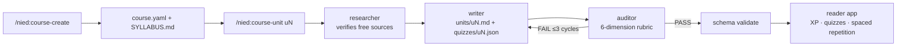

# nied


> Un framework educativo de agentes open-source: genera cursos completos de nivel
> universitario sobre cualquier tema con Claude Code, y estúdialos en una app web
> local gamificada.

**Estado: v0.1.0 — esquema de cursos, plugin de Claude Code, app lectora y un
curso demo generado por el framework.** Mira el [CHANGELOG](CHANGELOG.md).


[English version](README.md)

## Qué hace

- `/nied:course-create "tema"` — te entrevista, investiga el dominio de arriba hacia
  abajo y genera un sílabo completo (`course.yaml` + `SYLLABUS.md`).
- `/nied:course-unit u3` — investiga **fuentes primarias verificadas y 100% libres**
  y escribe una unidad completa y enseñable: explicaciones inline, LaTeX, diagramas
  Mermaid, videos embebidos, quizzes con corrección automática, práctica de
  recuperación y un proyecto final.
- `/nied:course-audit` — QA bloqueante: validación de esquema, verificación de URLs
  en vivo y una rúbrica pedagógica (profundidad universitaria, alineación con Bloom).

## Cómo funciona



El agente escritor no tiene herramientas de red, así que no puede fabricar URLs —
solo puede citar fuentes que el investigador ya descargó y verificó. El auditor es
una puerta bloqueante: una unidad que falla la rúbrica de 6 dimensiones vuelve al
escritor, hasta tres ciclos, antes de publicarse. La app lectora lee cualquier
curso que valide contra el esquema v1 — generado por nied o escrito a mano.


## Metodología (las reglas duras)

1. Fuentes 100% libres y primarias — cero contenido de pago.
2. Contenido enseñable inline — el sílabo es un índice; la unidad es el corazón.
3. Anti-fabricación: cada URL se descarga y verifica antes de incluirse.
4. Markdown es la verdad — las apps solo leen; el progreso vive en otro lado.
5. Gamificación no coercitiva.
6. Las unidades se generan de una en una, nunca un curso entero de un solo golpe.
7. Estructura canónica de dominio top-down; el anclaje a proyectos personales es
   opcional.

La justificación completa vive en [docs/methodology.es.md](docs/methodology.es.md).

## Curso demo

[`courses/estadistica-aplicada`](courses/estadistica-aplicada) es un curso de
estadística aplicada en español (nivel intro, 12 unidades). Sus unidades escritas
fueron generadas de punta a punta por el propio framework — investigación con
fuentes libres verificadas, escritura y auditoría adversarial — y las unidades
restantes están declaradas en el sílabo y pendientes, como ejemplo vivo de la
regla dura 6: los cursos crecen una unidad auditada a la vez.

## Instalación

Dentro de Claude Code:

```text
/plugin marketplace add nikklasblz/nied
/plugin install nied@nied
```

Como alternativa, desde un clon local de este repositorio:

```text
/plugin marketplace add <ruta-local-al-clon>   # registra el marketplace "nied" (el nombre viene de .claude-plugin/marketplace.json)
/plugin install nied@nied                      # instala el plugin "nied" desde el marketplace "nied"
```

O carga el plugin directamente para una sola sesión:

```text
claude --plugin-dir ./plugin
```

Mira [docs/getting-started.es.md](docs/getting-started.es.md) para la guía
completa, y [CONTRIBUTING.md](CONTRIBUTING.md) para contribuir.

## App lectora

Una app web local gamificada para estudiar los cursos generados: XP, rachas,
logros, quizzes con corrección automática y revisión por repetición espaciada
(método Leitner).


```text
bun install
cd app && bun run dev
```

Abre http://localhost:3000. Configuración mediante variables de entorno:
`NIED_COURSES_ROOT` (por defecto `../courses`), `NIED_UI_LANGUAGE` (`es` | `en`),
`NIED_DB_PATH`, `NIED_INSTANCE_NAME`, `NIED_XP_PER_HOUR` (por defecto `25`).

El progreso se guarda en un archivo SQLite local; la app nunca modifica el
contenido de los cursos. La base de datos de progreso es desechable —
el markdown es la verdad.

## Documentación

- [Primeros pasos](docs/getting-started.es.md) — de cero a un curso generado.
- [Metodología](docs/methodology.es.md) — las 7 reglas duras y por qué existen.
- [CHANGELOG.md](CHANGELOG.md) — historial de releases.
- [CONTRIBUTING.md](CONTRIBUTING.md) — cómo contribuir.

## Licencia

MIT
