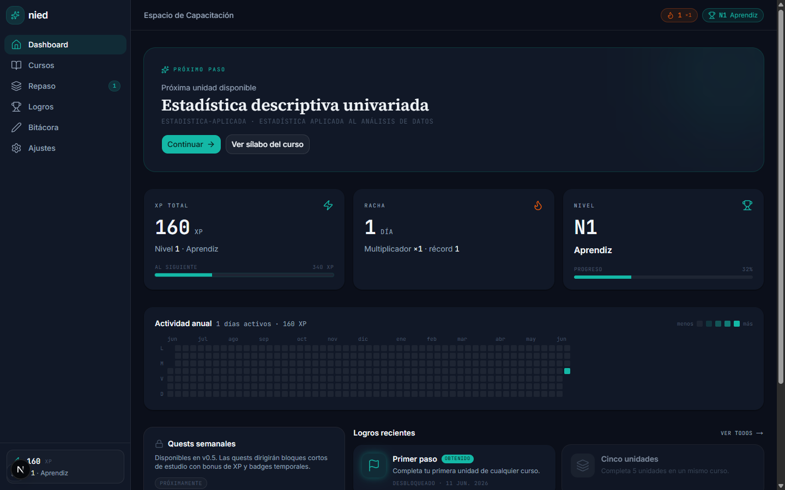
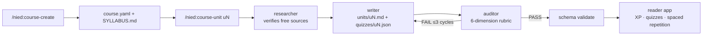
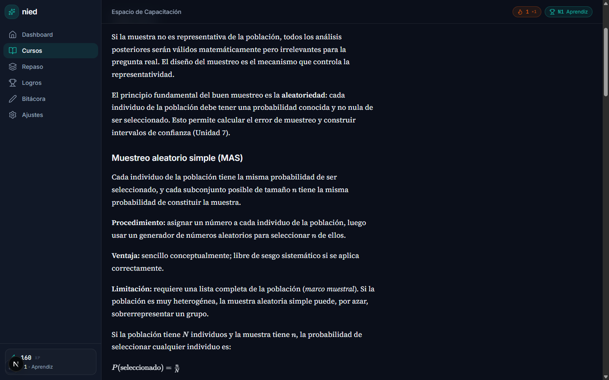
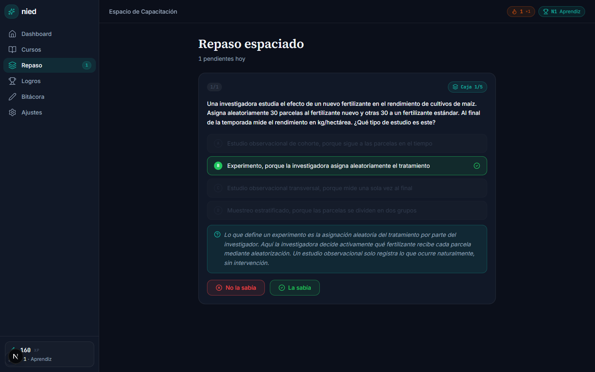

# nied


> An open-source educational agent framework: generate complete, university-grade
> courses on any topic with Claude Code, then study them in a gamified local web app.

**Status: v0.1.0 — course schema, Claude Code plugin, reader app, and a
framework-generated demo course.** See the [CHANGELOG](CHANGELOG.md).



[Versión en español](README.es.md)

## What it does

- `/nied:course-create "topic"` — interviews you, researches the domain top-down,
  and generates a full syllabus (`course.yaml` + `SYLLABUS.md`).
- `/nied:course-unit u3` — researches **verified, 100% free primary sources** and
  writes a complete teachable unit: inline explanations, LaTeX, Mermaid diagrams,
  embedded videos, auto-graded quizzes, retrieval practice, and a capstone.
- `/nied:course-audit` — blocking QA: schema validation, live-URL checks, and a
  pedagogical rubric (university-level depth, Bloom alignment).

## How it works



The writer agent has no network tools, so it cannot fabricate URLs — it can only
cite sources the researcher already fetched and verified. The auditor is a
blocking gate: a unit that fails the 6-dimension rubric goes back to the writer,
up to three cycles, before anything ships. The reader app reads any course that
validates against the course schema — generated by nied or written by hand.



## Methodology (the hard rules)

1. 100% free, primary sources — zero paywalled content.
2. Teachable inline content — the syllabus is an index; the unit is the heart.
3. Anti-fabrication: every URL is fetched and verified before inclusion.
4. Markdown is the truth — apps only read; progress lives elsewhere.
5. Non-coercive gamification.
6. Units are generated one at a time, never a whole course in one shot.
7. Top-down canonical domain structure; personal project anchoring is optional.

The full rationale lives in [docs/methodology.md](docs/methodology.md).

## Demo course

[`courses/estadistica-aplicada`](courses/estadistica-aplicada) is a Spanish
applied-statistics course (intro level, 12 units). Its written units were
generated end-to-end by the framework itself — research with verified free
sources, writing, and adversarial audit — and the remaining units are declared
in the syllabus and pending, as a live example of hard rule 6: courses grow one
audited unit at a time.

## Install

Inside Claude Code:

```text
/plugin marketplace add nikklasblz/nied
/plugin install nied@nied
```

Alternatively, from a local clone of this repo:

```text
/plugin marketplace add <local-path-to-this-clone>   # registers the "nied" marketplace (name comes from .claude-plugin/marketplace.json)
/plugin install nied@nied                            # installs the "nied" plugin from the "nied" marketplace
```

Or load the plugin directly for a single session:

```text
claude --plugin-dir ./plugin
```

See [docs/getting-started.md](docs/getting-started.md) for the full walkthrough,
and [CONTRIBUTING.md](CONTRIBUTING.md) to contribute.

## Reader app

A gamified local web app to study your generated courses: XP, streaks,
achievements, auto-graded quizzes, and spaced-repetition review (Leitner).



```text
bun install
cd app && bun run dev
```

Open http://localhost:3000. Configuration via env vars: `NIED_COURSES_ROOT`
(default `../courses`), `NIED_UI_LANGUAGE` (`es` | `en`), `NIED_DB_PATH`,
`NIED_INSTANCE_NAME`, `NIED_XP_PER_HOUR` (default `25`).

Progress lives in a local SQLite file; the app never modifies course content.
The progress database is disposable — markdown is the truth.

## Documentation

- [Getting started](docs/getting-started.md) — from zero to a generated course.
- [Methodology](docs/methodology.md) — the 7 hard rules and why they exist.
- [CHANGELOG.md](CHANGELOG.md) — release history.
- [CONTRIBUTING.md](CONTRIBUTING.md) — how to contribute.

## License

MIT
