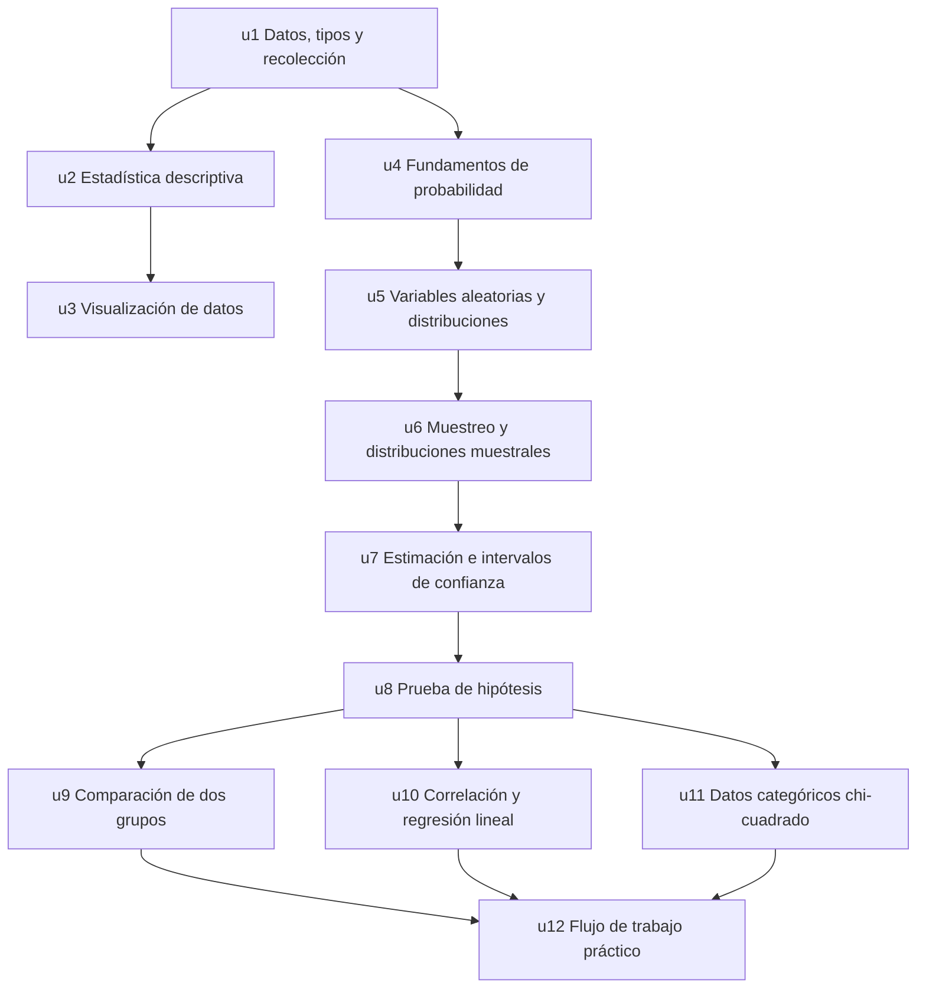

# Estadística aplicada al análisis de datos

**Nivel:** introductorio · **Idioma:** español · **Dedicación:** 8 horas/semana · **Duración estimada:** ~11 semanas (88 horas)

## Visión general

Este curso sigue la secuencia canónica universitaria de estadística introductoria (la que estructura OpenIntro Statistics, OpenStax *Introducción a la estadística* y MIT OCW 18.05). El objetivo terminal: **analizar datasets reales con estadística descriptiva e inferencial básica de forma rigurosa** — desde clasificar variables y resumir distribuciones hasta ejecutar pruebas de hipótesis, ajustar regresiones simples y producir reportes reproducibles.

El arco pedagógico tiene tres actos:

1. **Describir** (u1–u3): qué es un dato, cómo resumirlo y cómo visualizarlo honestamente.
2. **Razonar bajo incertidumbre** (u4–u6): probabilidad, distribuciones y el puente muestral que justifica toda inferencia.
3. **Inferir y aplicar** (u7–u12): intervalos de confianza, pruebas de hipótesis, comparaciones, regresión, datos categóricos y el flujo de trabajo integrador.

## Fuentes canónicas verificadas

Todas 100% libres y verificadas (vivas y con el contenido que declaran):

| Fuente | Idioma | Cobertura |
|---|---|---|
| [Introducción a la estadística — OpenStax](https://openstax.org/books/introducci%C3%B3n-estad%C3%ADstica/pages/1-introduccion) | ES | u1–u11 (texto de referencia primario) |
| [Estadísticas Introductorias — LibreTexts Español](https://espanol.libretexts.org/Bookshelves/Estadisticas/Estadisticas_Introductorias/Libro:_Estad%C3%ADsticas_Introductorias_(OpenStax)) | ES | Espejo HTML navegable del anterior, capítulos enlazables |
| [Estadística Descriptiva — Luis Rincón, UNAM 2017 (PDF)](https://docencia.fciencias.unam.mx/lars/libros/Rinc%C3%B3n(2017)Estad%C3%ADstica-descriptiva.pdf) | ES | u1–u3 con rigor universitario |
| [Introducción a la estadística inferencial — Luis Rincón, UNAM 2019 (PDF)](https://docencia.fciencias.unam.mx/lars/libros/Rinc%C3%B3n(2019)Estad%C3%ADstica-inferencial.pdf) | ES | u6–u9, u11 |
| [Estadística y probabilidad — Khan Academy](https://es.khanacademy.org/math/statistics-probability) | ES | Práctica y repaso de todo el curso |
| [OpenIntro Statistics, 4.ª ed.](https://www.openintro.org/book/os/) | EN | u1–u11 (textbook canónico, CC BY-SA) |
| [Introduction to Modern Statistics, 2.ª ed.](https://openintro-ims.netlify.app/) | EN | u1–u12, énfasis en simulación y flujo reproducible |
| [MIT OCW 18.05 (Spring 2022)](https://ocw.mit.edu/courses/18-05-introduction-to-probability-and-statistics-spring-2022/) | EN | u4–u8, u10: apuntes, problem sets con soluciones |
| [Seeing Theory — Brown University](https://seeing-theory.brown.edu/) | EN (parcial ES) | Visualizaciones interactivas de u4–u8, u10 |
| [Statistics Fundamentals — StatQuest (YouTube)](https://www.youtube.com/playlist?list=PLblh5JKOoLUK0FLuzwntyYI10UQFUhsY9) | EN | Videos de intuición u2–u11 |
| [Statistics — CrashCourse (YouTube)](https://www.youtube.com/playlist?list=PL8dPuuaLjXtNM_Y-bUAhblSAdWRnmBUcr) | EN | Serie de 44 videos, exposición inicial u1–u11 |

**Brechas conocidas:** no existe curso abierto universitario en español verificado que cubra el pipeline reproducible completo (u12) — se cubrirá con contenido inline + IMS; la estadística no paramétrica en texto abierto en español es escasa (u9 la cubrirá inline).

## Mapa de dependencias



## Unidades

### u1 — Datos, tipos y recolección (6 h)

**Objetivos:**
- Clasificar variables como cualitativas/cuantitativas y nominales/ordinales/discretas/continuas en datasets reales.
- Distinguir estudios observacionales de experimentos y explicar qué conclusiones permite cada uno.
- Identificar diseños de muestreo (aleatorio simple, estratificado, por conglomerados) y fuentes de sesgo.

**Conceptos clave:** unidad de observación, variable, escalas de medición, población vs. muestra, sesgo de selección, sesgo de no respuesta, confusión.

**Fuentes:** OpenStax ES cap. 1; OpenIntro cap. 1; Rincón (2017) cap. 1; CrashCourse #1–3.

### u2 — Estadística descriptiva univariada (8 h)

**Objetivos:**
- Calcular e interpretar medidas de posición (media, mediana, moda, percentiles).
- Calcular e interpretar medidas de dispersión (rango, varianza, desviación estándar, IQR).
- Elegir el resumen apropiado según la forma y los atípicos de la distribución.
- Detectar atípicos con la regla de 1.5·IQR y el z-score.

**Conceptos clave:** robustez, asimetría, curtosis, estandarización, resumen de cinco números.

**Fuentes:** OpenStax ES cap. 2; Rincón (2017) caps. 2–3; StatQuest "Mean, Variance and Standard Deviation"; Khan Academy ES (datos cuantitativos).

### u3 — Visualización de datos (6 h)

**Objetivos:**
- Construir e interpretar histogramas, boxplots, gráficos de barras y dispersión.
- Seleccionar el gráfico adecuado según tipo de variable y pregunta.
- Detectar y corregir visualizaciones engañosas.

**Conceptos clave:** elección de bins, percepción visual, ejes truncados, razón tinta/datos.

**Fuentes:** OpenStax ES cap. 2; OpenIntro cap. 2; Rincón (2017) cap. 2; CrashCourse #5–7.

### u4 — Fundamentos de probabilidad (8 h)

**Objetivos:**
- Calcular probabilidades con reglas de adición, multiplicación y complemento.
- Calcular probabilidades condicionales y evaluar independencia.
- Aplicar el teorema de Bayes a problemas de diagnóstico.

**Conceptos clave:** espacio muestral, evento, probabilidad condicional, independencia, falso positivo/negativo.

**Fuentes:** OpenStax ES cap. 3; MIT 18.05 lecturas 1–3; Seeing Theory (Basic/Compound Probability); Khan Academy ES.

### u5 — Variables aleatorias y distribuciones (8 h)

**Objetivos:**
- Calcular esperanza y varianza de variables discretas.
- Modelar conteos y proporciones con Binomial y Poisson.
- Calcular probabilidades Normales estandarizando con z.
- Reconocer cuándo usar t, chi-cuadrado y F.

**Conceptos clave:** función de masa/densidad, esperanza, regla empírica 68-95-99.7, tablas z.

**Fuentes:** OpenStax ES caps. 4–6; MIT 18.05 lecturas 4–6; Seeing Theory (Probability Distributions); StatQuest (Normal Distribution).

### u6 — Muestreo y distribuciones muestrales (6 h)

**Objetivos:**
- Explicar la distribución muestral de la media y de la proporción.
- Aplicar el Teorema del Límite Central.
- Calcular e interpretar el error estándar.

**Conceptos clave:** estadístico vs. parámetro, TLC, error estándar, ley de los grandes números.

**Fuentes:** OpenStax ES cap. 7; Rincón (2019) cap. 1; Seeing Theory (Frequentist Inference); StatQuest (CLT).

### u7 — Estimación e intervalos de confianza (8 h)

**Objetivos:**
- Construir IC para una media (z y t) y para una proporción.
- Interpretar correctamente el nivel de confianza.
- Determinar tamaño de muestra para un margen de error objetivo.

**Conceptos clave:** estimador puntual, margen de error, distribución t de Student, grados de libertad.

**Fuentes:** OpenStax ES cap. 8; Rincón (2019) cap. 2; MIT 18.05 (confidence intervals); StatQuest (Confidence Intervals).

### u8 — Prueba de hipótesis (8 h)

**Objetivos:**
- Formular H₀ y H₁ a partir de una pregunta de investigación.
- Ejecutar pruebas para una media y una proporción e interpretar el valor p.
- Distinguir errores tipo I y II; explicar la potencia.
- Diferenciar significancia estadística de relevancia práctica.

**Conceptos clave:** valor p, nivel de significancia α, región de rechazo, potencia, p-hacking.

**Fuentes:** OpenStax ES cap. 9; Rincón (2019) cap. 3; MIT 18.05 (NHST); StatQuest (Hypothesis Testing, p-values).

### u9 — Comparación de dos grupos (8 h)

**Objetivos:**
- Ejecutar e interpretar pruebas t independientes y pareadas.
- Comparar dos proporciones con prueba z.
- Verificar supuestos y elegir alternativas no paramétricas (Wilcoxon/Mann-Whitney).

**Conceptos clave:** diseño pareado vs. independiente, homogeneidad de varianzas, tamaño del efecto.

**Fuentes:** OpenStax ES cap. 10; Rincón (2019); OpenIntro cap. 7; StatQuest (t-tests). *No paramétrica: contenido inline (brecha en fuentes ES).*

### u10 — Correlación y regresión lineal simple (8 h)

**Objetivos:**
- Calcular e interpretar Pearson; distinguir correlación de causalidad.
- Ajustar regresión por mínimos cuadrados; interpretar pendiente e intercepto.
- Evaluar ajuste con R² y diagnosticar residuos.
- Inferencia sobre la pendiente (IC y prueba).

**Conceptos clave:** mínimos cuadrados, residuo, R², extrapolación, puntos influyentes, cuarteto de Anscombe.

**Fuentes:** OpenStax ES cap. 12; OpenIntro cap. 8; MIT 18.05 (regression); Seeing Theory (Regression Analysis); StatQuest (Linear Regression).

### u11 — Análisis de datos categóricos (chi-cuadrado) (6 h)

**Objetivos:**
- Construir e interpretar tablas de contingencia.
- Ejecutar chi-cuadrado de independencia y de bondad de ajuste.
- Verificar condiciones de validez y reportar correctamente.

**Conceptos clave:** frecuencias esperadas, grados de libertad, condición de conteos ≥ 5.

**Fuentes:** OpenStax ES cap. 11; Rincón (2019); OpenIntro cap. 6; CrashCourse #29.

### u12 — Flujo de trabajo práctico de análisis de datos (8 h)

**Objetivos:**
- Ejecutar un pipeline completo: importar, limpiar, explorar, inferir, reportar.
- Seleccionar la prueba correcta según tipos de variables y diseño.
- Producir un reporte reproducible con decisiones, supuestos y limitaciones.

**Conceptos clave:** EDA, datos faltantes, árbol de decisión de pruebas, reproducibilidad, reporte estadístico.

**Fuentes:** Introduction to Modern Statistics (caps. de aplicación); contenido inline (brecha: no existe curso abierto ES verificado para este bloque).

## Ritmo sugerido (8 h/semana)

| Semana | Contenido |
|---|---|
| 1 | u1 (6 h) + inicio u2 (2 h) |
| 2 | u2 (6 h restantes) + inicio u3 (2 h) |
| 3 | u3 (4 h restantes) + inicio u4 (4 h) |
| 4 | u4 (4 h restantes) + inicio u5 (4 h) |
| 5 | u5 (4 h restantes) + inicio u6 (4 h) |
| 6 | u6 (2 h restantes) + inicio u7 (6 h) |
| 7 | u7 (2 h restantes) + inicio u8 (6 h) |
| 8 | u8 (2 h restantes) + inicio u9 (6 h) |
| 9 | u9 (2 h restantes) + inicio u10 (6 h) |
| 10 | u10 (2 h restantes) + u11 (6 h) |
| 11 | u12 (8 h) — capstone integrador |

Tras u8 el grafo se abre: u9, u10 y u11 solo dependen de u8, así que su orden interno es flexible si prefieres adelantar regresión o chi-cuadrado.

## Cómo continuar

Genera las unidades una por una (regla dura 6):

```
/nied:course-unit u1 --dir D:\nied\courses\test-estadistica
```
