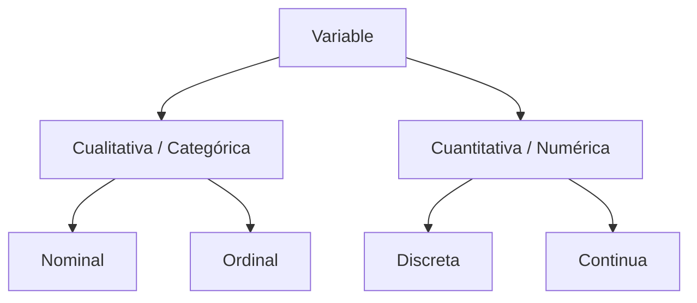
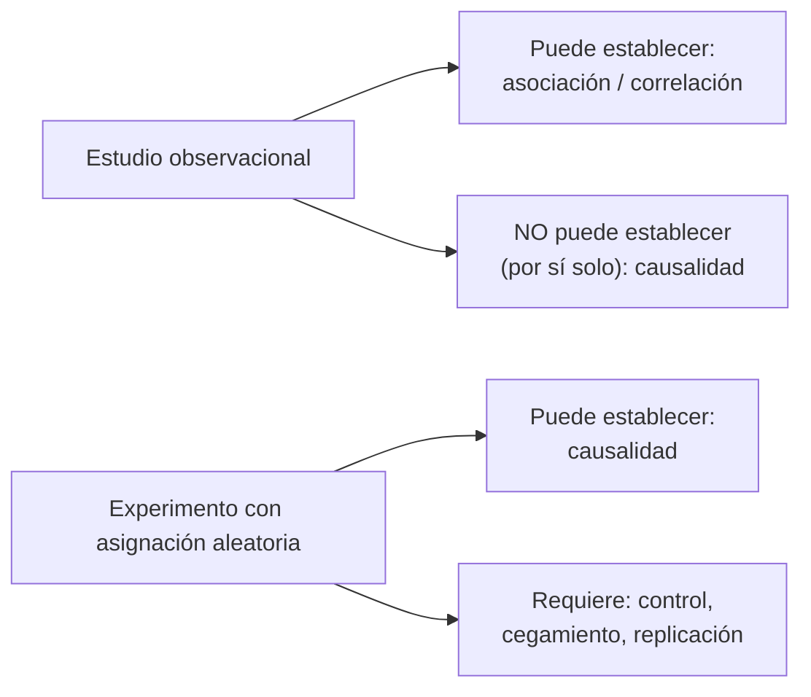
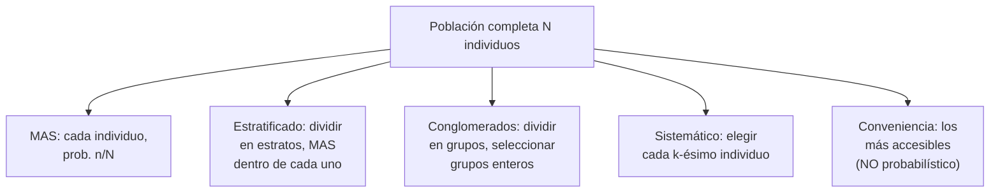
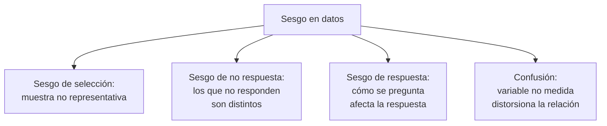
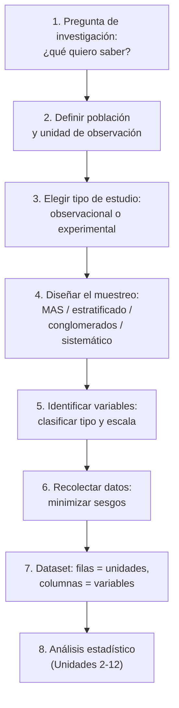

# Datos, tipos y recolección

## Por qué importa esta unidad

Todo análisis estadístico comienza antes de correr una sola fórmula: en el momento en que alguien decide *qué* medir, *a quiénes* medir y *cómo* hacerlo. Esas decisiones determinan qué preguntas pueden responderse con los datos y cuáles quedan sin respuesta. Un estadístico que no domina esta etapa puede construir modelos perfectamente ejecutados sobre datos fundamentalmente mal recolectados — y llegar a conclusiones incorrectas con total confianza.

Esta unidad es la base de todo el curso. Cuando en la Unidad 8 evalúes si los resultados de una prueba de hipótesis son válidos, necesitarás saber si los datos provienen de una muestra representativa o sesgada. Cuando en la Unidad 10 interpretes una correlación entre dos variables, necesitarás saber si el estudio fue observacional o experimental para decidir si puedes hablar de causalidad.

Al terminar esta unidad serás capaz de:

1. Clasificar cualquier variable de un dataset real como cualitativa o cuantitativa, y dentro de cada categoría asignarle su escala de medición correcta (nominal, ordinal, discreta o continua).
2. Distinguir un estudio observacional de un experimento y explicar con precisión qué tipo de conclusiones permite cada diseño.
3. Identificar los principales diseños de muestreo (aleatorio simple, estratificado, por conglomerados, sistemático) y reconocer fuentes de sesgo que comprometen la validez de los resultados.

**Tiempo estimado:** 6 horas (lectura activa + ejercicios).

---

## 1. La anatomía de un dataset: población, muestra y unidad de observación

### Explicación

Imagina que un investigador quiere saber cuántas horas semanales duermen los estudiantes universitarios en tu país. La *población* es el conjunto completo de todos los individuos sobre los que se quiere sacar conclusiones — en este caso, todos los estudiantes universitarios del país. Como entrevistar a cada uno es imposible, se selecciona una *muestra*: un subconjunto de la población que será realmente medido.

La **unidad de observación** (también llamada *individuo* o *caso*) es el objeto sobre el que se toman mediciones. En el ejemplo anterior es cada estudiante. Pero las unidades de observación no tienen que ser personas: pueden ser empresas, hospitales, semanas, transacciones bancarias, o cualquier entidad sobre la que se recopile información.

Una vez definida la unidad de observación, cada característica que se mide en ella es una **variable**. "Horas de sueño", "carrera universitaria" y "consume cafeína" son tres variables distintas del mismo individuo.

La distinción población / muestra tiene consecuencias formales importantes. Usamos letras distintas para sus resúmenes numéricos:

- Un **parámetro** describe a la población (por ejemplo, la media poblacional $\mu$ o la proporción poblacional $p$).
- Un **estadístico** describe a la muestra (la media muestral $\bar{x}$ o la proporción muestral $\hat{p}$).

El estadístico es lo que calculamos; el parámetro es lo que queremos estimar. Esta distinción sustenta toda la inferencia estadística (Unidades 6–8).

### Ejemplo trabajado

**Dataset: Encuesta de hábitos de transporte urbano**

Un municipio encuesta a 400 usuarios de transporte público para evaluar el sistema. La tabla contiene estas columnas:

| id_pasajero | edad | línea_bus | tiempo_espera_min | satisfacción (1–5) | tiene_auto |
|---|---|---|---|---|---|
| 001 | 34 | Línea A | 8 | 4 | No |
| 002 | 22 | Línea C | 15 | 2 | Sí |
| ... | ... | ... | ... | ... | ... |

- **Población de interés:** todos los usuarios habituales del sistema de transporte del municipio.
- **Muestra:** los 400 encuestados.
- **Unidad de observación:** cada pasajero encuestado.
- **Variables:** edad, línea_bus, tiempo_espera_min, satisfacción, tiene_auto.
- **Parámetro de interés:** tiempo medio de espera de *todos* los usuarios, $\mu$.
- **Estadístico calculable:** tiempo medio de espera en la muestra, $\bar{x}$.

> **Distinción clave:** si el municipio hubiera logrado encuestar al 100 % de todos sus pasajeros, estaríamos hablando de un *censo*, y $\bar{x}$ sería igual a $\mu$ por definición. En la práctica, casi siempre trabajamos con muestras.

---

> **Punto de recuperación 1.1**
>
> 1. ¿Cuál es la diferencia entre un parámetro y un estadístico?
> 2. En el dataset de transporte anterior, ¿cuál es la unidad de observación?
> 3. Si en lugar de encuestar a 400 pasajeros el municipio registrara a *todos* los usuarios durante un mes, ¿seguiría siendo una muestra o se convertiría en un censo?

*(Respuestas al final de la unidad.)*

---

## 2. Tipos de variables y escalas de medición

### Explicación

Clasificar una variable correctamente no es un trámite burocrático. La clasificación determina qué operaciones matemáticas son válidas, qué estadísticos son apropiados y qué gráficos tienen sentido. Sumar los códigos postales de dos personas es matemáticamente posible pero estadísticamente absurdo.

El árbol de clasificación funciona en dos niveles:

**Variables cualitativas (categóricas):** representan categorías sin valor numérico inherente.

- **Nominal:** las categorías no tienen orden natural. Ejemplos: color de ojos (café, verde, azul), tipo de sangre (A, B, AB, O), nombre de la ciudad. No tiene sentido decir que "azul > verde". Las únicas operaciones válidas son contar frecuencias y calcular proporciones.

- **Ordinal:** las categorías sí tienen un orden natural, pero las *distancias* entre categorías no son iguales ni medibles. Ejemplos: nivel educativo (primaria < secundaria < universitaria), escala de satisfacción (1 = muy insatisfecho, 5 = muy satisfecho), grado de dolor (leve, moderado, severo). Podemos decir que "moderado > leve", pero no podemos afirmar que la diferencia entre "leve" y "moderado" es igual a la diferencia entre "moderado" y "severo".

**Variables cuantitativas (numéricas):** representan cantidades sobre las que las operaciones aritméticas tienen significado real.

- **Discreta:** toma valores enteros contables; no hay valores intermedios posibles entre dos valores consecutivos. Ejemplos: número de hijos (0, 1, 2, 3, ...), número de accidentes en una semana, número de respuestas correctas en un examen. No existe "1.7 hijos".

- **Continua:** puede tomar cualquier valor dentro de un intervalo, incluidos decimales. En teoría, entre dos mediciones siempre existe otra posible. Ejemplos: estatura (1.72 m, 1.725 m, 1.7253 m...), temperatura, tiempo de espera, peso corporal.

> **Nota práctica:** en datasets reales, algunas variables continuas aparecen redondeadas y parecen discretas (la edad registrada en años enteros). La clasificación correcta depende de la naturaleza subyacente del fenómeno, no de cómo aparezca almacenado el dato.

### Las escalas de Stevens (ampliación)

Stanley Smith Stevens (1946) propuso una jerarquía de cuatro escalas que también encontrarás en muchos textos:

| Escala | Propiedades | Operaciones válidas | Ejemplo |
|---|---|---|---|
| **Nominal** | Solo identidad | Contar, moda | Código postal, tipo de sangre |
| **Ordinal** | Orden | Lo anterior + ordenar, mediana | Nivel de dolor, grado educativo |
| **Intervalo** | Orden + distancias iguales, **sin cero absoluto** | Lo anterior + suma/resta, media | Temperatura en °C, año del calendario |
| **Razón** | Orden + distancias iguales + **cero absoluto** | Todo, incluso cocientes | Peso, altura, ingreso, tiempo |

La distinción intervalo/razón responde a si el cero significa "ausencia". En la escala Celsius, 0 °C no significa "ausencia de temperatura" (es solo el punto de congelación del agua), por lo que decir "40 °C es el doble de caliente que 20 °C" es incorrecto. En cambio, una persona que pesa 80 kg *sí* pesa el doble que una de 40 kg porque el cero en kilogramos implica ausencia de masa.

Para el trabajo cotidiano de este curso, la distinción más operativa es la del árbol de dos niveles (cualitativa/cuantitativa y sus subtipos), ya que determina directamente qué prueba estadística aplicar.

### Ejemplo trabajado

Volvamos al dataset de transporte y clasifiquemos cada variable:

| Variable | Tipo | Escala | Justificación |
|---|---|---|---|
| `edad` | Cuantitativa discreta (o continua) | Razón | El 0 significa ausencia de edad; admite proporciones ("doble de años"). Ambas respuestas son defendibles — ver la **Nota práctica** de esta sección: registrada en años enteros parece discreta, pero el fenómeno subyacente es continuo |
| `línea_bus` | Cualitativa nominal | Nominal | "Línea A" y "Línea C" son etiquetas sin orden |
| `tiempo_espera_min` | Cuantitativa continua | Razón | Puede tomar cualquier valor positivo; el 0 significa espera nula |
| `satisfacción (1–5)` | Cualitativa ordinal | Ordinal | Hay orden (5 > 4), pero la diferencia entre 1 y 2 no es necesariamente igual a la diferencia entre 4 y 5 |
| `tiene_auto` | Cualitativa nominal | Nominal | Solo dos categorías sin orden: "Sí" / "No" |

> **Trampa común:** muchos estudiantes clasifican la satisfacción (1–5) como cuantitativa discreta porque son números. El error es que los números son etiquetas ordinales, no magnitudes. Si un pasajero pasa de satisfacción 2 a 4, no significa que su satisfacción "se duplicó"; simplemente subió dos categorías en la escala.

---

> **Punto de recuperación 2.1**
>
> 1. ¿Por qué la temperatura en grados Celsius es de escala intervalo y no razón?
> 2. Clasifica estas variables del siguiente dataset de una clínica: `diagnóstico (Sano/Enfermo)`, `presión sistólica (mmHg)`, `número de visitas al médico este año`, `nivel de dolor (Ninguno/Leve/Moderado/Severo)`.
> 3. ¿Qué escala tiene la variable "número de visitas"? ¿Por qué no puede ser continua?

*(Respuestas al final de la unidad.)*

---

## 3. Estudios observacionales versus experimentos

### Explicación

Una de las preguntas más importantes en estadística es: **¿pueden estos datos establecer una relación de causa y efecto?** La respuesta depende casi exclusivamente del tipo de estudio que los generó.

**Estudio observacional:** el investigador observa y registra lo que ocurre de manera natural, sin intervenir ni asignar tratamientos. Los participantes hacen lo que habrían hecho de todas formas. Ejemplo: registrar el nivel de colesterol y los hábitos alimenticios de 1.000 personas durante cinco años.

**Experimento:** el investigador interviene activamente, *asignando* de forma aleatoria a los participantes a diferentes condiciones (tratamientos). Ejemplo: asignar al azar a 500 personas a tomar un medicamento y a otras 500 a tomar un placebo, y medir su colesterol después de seis meses.

La diferencia crucial es la **asignación aleatoria**. Cuando se asigna aleatoriamente, los grupos son comparables en promedio en *todos* los factores posibles — tanto los que medimos como los que no. Esto permite atribuir las diferencias en el resultado al tratamiento, no a otras variables.

### El problema de la confusión

La razón por la que los estudios observacionales no pueden probar causalidad es la **variable de confusión** (o *confusor*): una tercera variable que está asociada tanto con la variable explicativa como con la variable respuesta, y que puede crear una asociación espuria entre ellas.

**Ejemplo clásico:** en un estudio observacional se observa que las ciudades con más iglesias tienen más crímenes. ¿Las iglesias causan crímenes? No. La variable de confusión es el *tamaño de la población*: ciudades más grandes tienen más iglesias *y* más crímenes simplemente porque hay más personas.

Otro ejemplo: estudios observacionales muestran que los zurdos tienen menor esperanza de vida promedio. ¿Ser zurdo es peligroso? No necesariamente. Una explicación es el sesgo de *cohorte*: las generaciones mayores fueron forzadas a escribir con la mano derecha, por lo que entre los ancianos hay pocos zurdos "naturales". Los datos observacionales mezclan este efecto histórico con la asociación real.

### Componentes de un experimento bien diseñado

Para que un experimento pueda establecer causalidad necesita:

1. **Asignación aleatoria:** los participantes se asignan a grupos por azar (sorteo, tabla de números aleatorios, software). Esto balancea los confusores conocidos *y* desconocidos.
2. **Grupo de control:** un grupo que no recibe el tratamiento activo (o recibe el estándar de comparación). Sin control, no hay punto de referencia.
3. **Cegamiento:** si los participantes saben en qué grupo están, pueden cambiar su comportamiento (*efecto placebo*). Si los evaluadores saben qué tratamiento recibió cada participante, pueden (inconscientemente) medir diferente. El *doble ciegamiento* protege contra ambos sesgos.
4. **Replicación:** suficientes unidades por grupo para que los resultados sean estables y no se deban al azar.

### Cuándo el experimento no es ético o factible

No siempre podemos experimentar. No podemos asignar aleatoriamente a personas a fumar durante 30 años para estudiar el cáncer pulmonar. En esos casos, los estudios observacionales bien diseñados (cohortes prospectivas, estudios de casos y controles, diseños de diferencias en diferencias) son la mejor herramienta disponible, pero sus conclusiones causales requieren argumentación adicional y cautela.

### Ejemplo trabajado

**Escenario A — Observacional:**
Una empresa de tecnología analiza sus registros internos y nota que los empleados que usan el horario flexible tienen menor tasa de ausentismo que los que tienen horario fijo. ¿Puede concluir que el horario flexible *reduce* el ausentismo?

No directamente. Los empleados que eligieron horario flexible pueden ser en promedio más motivados, con mejores condiciones de salud o con mayor antigüedad — todos confusores posibles. La correlación existe, pero la causalidad no está probada.

**Escenario B — Experimental:**
La misma empresa asigna *aleatoriamente* a 200 empleados nuevos al horario flexible y a 200 al horario fijo durante un año, midiendo el ausentismo. Ahora los grupos son comparables desde el inicio. Si los de horario flexible tienen menor ausentismo, la diferencia se puede atribuir al horario.

::video{src="https://www.youtube.com/watch?v=w7UY8gi29fk" caption="Khan Academy en Español — Tipos de estudios estadísticos (~5 min). El video explica en español la diferencia entre estudio muestral, estudio observacional y experimento, e ilustra qué tipo de conclusiones permite cada diseño."}

---

> **Punto de recuperación 3.1**
>
> 1. Un estudio observa que los niños que comen desayuno tienen mejores calificaciones. ¿Qué variable de confusión podría explicar esta relación sin que el desayuno cause el buen rendimiento?
> 2. ¿Por qué la asignación aleatoria elimina el efecto de los confusores, incluso de aquellos que no conocemos?
> 3. Nombra una situación real en la que sería imposible o poco ético realizar un experimento aleatorizado.

*(Respuestas al final de la unidad.)*

---

## 4. Diseños de muestreo

### Explicación

Si la muestra no es representativa de la población, todos los análisis posteriores serán válidos matemáticamente pero irrelevantes para la pregunta real. El diseño del muestreo es el mecanismo que controla la representatividad.

El principio fundamental del buen muestreo es la **aleatoriedad**: cada individuo de la población debe tener una probabilidad conocida y no nula de ser seleccionado. Esto permite calcular el error de muestreo y construir intervalos de confianza (Unidad 7).

### Muestreo aleatorio simple (MAS)

Cada individuo de la población tiene la misma probabilidad de ser seleccionado, y cada subconjunto posible de tamaño $n$ tiene la misma probabilidad de constituir la muestra.

**Procedimiento:** asignar un número a cada individuo de la población, luego usar un generador de números aleatorios para seleccionar $n$ de ellos.

**Ventaja:** sencillo conceptualmente; libre de sesgo sistemático si se aplica correctamente.

**Limitación:** requiere una lista completa de la población (*marco muestral*). Si la población es muy heterogénea, la muestra aleatoria simple puede, por azar, sobrerrepresentar un grupo.

Si la población tiene $N$ individuos y la muestra tiene $n$, la probabilidad de seleccionar cualquier individuo es:

$$P(\text{seleccionado}) = \frac{n}{N}$$

### Muestreo estratificado

Se divide la población en *estratos* homogéneos (grupos definidos por una característica relevante como sexo, región geográfica o nivel educativo), y luego se toma una muestra aleatoria simple *dentro* de cada estrato.

**Ventaja:** garantiza representación de subgrupos importantes, incluso si son pequeños. Reduce la variabilidad total del estimador cuando los estratos son internamente homogéneos.

**Ejemplo:** para encuestar a estudiantes universitarios sobre préstamos estudiantiles, se estratifica por carrera (ciencias, humanidades, ingeniería, salud) y se muestrea dentro de cada estrato proporcionalmente.

### Muestreo por conglomerados (clusters)

Se divide la población en *conglomerados* que son grupos heterogéneos internamente pero similares entre sí (idealmente, cada conglomerado es una "mini-población"). Se seleccionan aleatoriamente algunos conglomerados completos y se incluye a *todos* sus miembros.

**Ejemplo:** para encuestar hogares en una ciudad, se dividen las manzanas en conglomerados y se visitan todas las viviendas de las manzanas seleccionadas.

**Ventaja:** muy eficiente cuando la lista de individuos no existe pero sí la de conglomerados; reduce costos logísticos.

**Limitación:** si los conglomerados seleccionados son atípicos, la muestra será sesgada.

### Muestreo sistemático

Se selecciona uno de los primeros $k$ individuos al azar y luego se escoge cada $k$-ésimo individuo de la lista. Si la lista tiene $N$ individuos y queremos una muestra de $n$:

$$k = \left\lfloor \frac{N}{n} \right\rfloor$$

**Ejemplo:** en una fábrica que produce 10.000 piezas al día, se quiere inspeccionar 100. Se calcula $k = 100$ y se selecciona una pieza de cada 100 en la línea de producción.

**Advertencia sobre periodicidad:** si existe un patrón periódico en la lista con el mismo período que $k$, el muestreo sistemático producirá una muestra sesgada. Por ejemplo, imaginemos que una tienda de conveniencia quiere muestrear 1 de cada 7 transacciones ($k = 7$) para estudiar el gasto promedio de sus clientes. Si el punto de arranque cae en un domingo y la lista está ordenada cronológicamente, el muestreo seleccionará siempre transacciones de domingo — justamente el día con compras más grandes por familias que hacen sus compras semanales. El gasto promedio estimado quedará sobreestimado porque nunca se seleccionan los días laborables con compras más pequeñas. La clave es verificar que el intervalo $k$ no coincida con ningún ciclo natural del fenómeno (semanal, mensual, por turno, etc.).

### Muestreo por conveniencia (no probabilístico)

Se seleccionan individuos por facilidad de acceso. Ejemplo: encuestar a los primeros 50 estudiantes que pasan por la biblioteca.

**Problema grave:** no es aleatorio. No hay forma de calcular el error de muestreo ni garantizar representatividad. Las conclusiones solo son válidas para los individuos encuestados, no para la población.

### Comparación visual

### Ejemplo trabajado

**Problema:** Una universidad con 8.000 estudiantes quiere estimar qué porcentaje usa transporte público. Tiene cuatro facultades de tamaño similar (2.000 estudiantes cada una). Se quiere una muestra de 400 estudiantes.

**Opción A — MAS:** numerar a los 8.000 estudiantes del 1 al 8.000, seleccionar 400 con números aleatorios. Todos tienen probabilidad 400/8.000 = 5%.

**Opción B — Estratificado:** las cuatro facultades son los estratos. Se seleccionan 100 estudiantes al azar dentro de cada facultad. Se garantiza representación de cada facultad.

**Opción C — Conglomerados:** si la lista de estudiantes no existe pero sí la de salones de clase (hay 200 salones de 40 alumnos cada uno), se eligen 10 salones al azar y se encuesta a todos sus alumnos (10 × 40 = 400).

**¿Cuál elegir?** Si se sospecha que el uso de transporte varía mucho entre facultades, el estratificado es mejor. Si el acceso a la lista completa es difícil, los conglomerados son más prácticos. Si no hay razón para esperar diferencias entre grupos, el MAS es suficiente.

::video{src="https://www.youtube.com/watch?v=Rf-fIpB4D50" caption="CrashCourse Statistics #10 — Sampling Methods and Bias with Surveys (~11 min, en inglés). Cubre con ejemplos visuales los mismos cuatro diseños de muestreo y explica los sesgos más comunes en encuestas. Recomendado como refuerzo visual después de leer esta sección."}

---

> **Punto de recuperación 4.1**
>
> 1. ¿Cuál es la diferencia fundamental entre muestreo estratificado y por conglomerados?
> 2. Si la lista de una empresa tiene los empleados ordenados por departamento (todos los de Finanzas juntos, luego todos los de Ventas, etc.), ¿qué problema podría tener el muestreo sistemático?
> 3. Un periodista encuesta a sus 5.000 seguidores en redes sociales para un artículo sobre opinión pública. ¿Por qué este diseño es problemático?

*(Respuestas al final de la unidad.)*

---

## 5. Fuentes de sesgo en la recolección de datos

### Explicación

Un sesgo es cualquier error sistemático en la recolección de datos que distorsiona los resultados de forma no aleatoria. A diferencia del error de muestreo (que es aleatorio y disminuye al aumentar $n$), el sesgo no desaparece con muestras más grandes — se vuelve más preciso en la dirección equivocada.

Los sesgos más importantes en estudios estadísticos son:

### Sesgo de selección

Ocurre cuando el método de selección de la muestra favorece sistemáticamente a ciertos individuos sobre otros, haciendo que la muestra no represente a la población objetivo.

**Ejemplo histórico:** en 1936, la revista *Literary Digest* encuestó a 2,4 millones de personas y predijo que Alf Landon ganaría la presidencia de los EE.UU. con amplia mayoría. Franklin Roosevelt ganó por aplastante diferencia. ¿Qué salió mal? Los encuestados fueron tomados de directorios telefónicos y listas de automóviles — personas con más recursos económicos, que tendían a preferir a Landon. La muestra era enorme pero sesgada.

**Sesgo del superviviente:** solo se analizan los individuos que "sobrevivieron" algún proceso de selección. Ejemplo: estudiar solo a las empresas que están activas hoy para entender qué hace exitosa a una empresa ignora a las que fracasaron.

### Sesgo de no respuesta

Ocurre cuando hay una diferencia sistemática entre los individuos que sí responden y los que no. Si los que no responden son distintos en alguna característica relevante, los resultados estarán distorsionados.

**Ejemplo:** una encuesta sobre satisfacción laboral obtiene 30% de respuesta. Es probable que los empleados muy satisfechos o muy insatisfechos respondan más que los neutrales, distorsionando la estimación de la satisfacción media.

**Distinción:** el sesgo de no respuesta no es lo mismo que la pérdida de precisión por muestra pequeña. El problema no es que tengamos menos datos, sino que los datos que tenemos no son representativos.

### Sesgo de respuesta

La forma en que se formula una pregunta, el orden de las preguntas, o la presencia del encuestador puede influir en las respuestas. También se llama *sesgo de deseabilidad social* cuando los encuestados responden lo que creen que es "correcto" o lo que agrada al entrevistador.

**Ejemplo:** "¿Está usted de acuerdo en que el gobierno debería aumentar los impuestos para mejorar la salud pública?" es una pregunta cargada que sugiere la respuesta. "¿Está usted a favor o en contra de aumentar los impuestos sobre la renta?" es más neutral.

### Confusión (variable confusora)

Ya se presentó en la sección anterior. En el contexto del muestreo y análisis de datos, una variable confusora es aquella que está asociada tanto con la variable de interés como con el resultado, y que no se midió o no se controló. Introduce una asociación aparente que no refleja la relación real.

### Resumen de sesgos

### Ejemplo trabajado

**Dataset: Encuesta sobre consumo de alcohol en estudiantes**

Una universidad distribuye una encuesta en papel sobre consumo de alcohol en el comedor estudiantil a la hora del almuerzo. Los resultados muestran un promedio de 1,2 bebidas alcohólicas por semana.

Identifica los sesgos presentes:

1. **Sesgo de selección:** solo se encuesta a los que almuerzan en el comedor. Los estudiantes que no van al comedor (quizás por vivir fuera del campus o por horarios distintos) quedan excluidos. Su consumo de alcohol podría ser diferente.

2. **Sesgo de no respuesta:** algunos estudiantes en el comedor no completaron la encuesta. Si los que tienen mayor consumo son más reacios a responder (por vergüenza o por estar ocupados), el promedio estará subestimado.

3. **Sesgo de respuesta:** al ser una encuesta en papel en un entorno social, los estudiantes pueden reportar menor consumo del real por deseo de no parecer socialmente inaceptables.

**Consecuencia:** el valor de 1,2 bebidas/semana probablemente subestima el consumo real. El diseño tiene múltiples fuentes de sesgo que se acumulan.

---

> **Punto de recuperación 5.1**
>
> 1. ¿Por qué una muestra muy grande no resuelve el sesgo de selección?
> 2. Define la diferencia entre sesgo de no respuesta y sesgo de respuesta.
> 3. En un estudio sobre efectividad de vacunas, los investigadores notan que los vacunados tienen en promedio mejor salud general que los no vacunados *antes* de recibir la vacuna. ¿Qué sesgo explica esta observación?

*(Respuestas al final de la unidad.)*

---

## 6. Flujo completo: del fenómeno al dato analizable

### Explicación

Esta sección integra todos los conceptos anteriores en una visión del proceso completo que va desde la pregunta de investigación hasta el dataset listo para analizar.

Un dataset bien estructurado sigue el principio *tidy*: cada fila es una unidad de observación, cada columna es una variable, cada celda es un valor único. Este formato es el punto de entrada para todos los análisis del resto del curso.

### Ejemplo integrador

**Pregunta:** ¿Influye la metodología de enseñanza (clases magistrales vs. aprendizaje activo) en las calificaciones de estudiantes universitarios de primer año?

| Paso | Decisión |
|---|---|
| Población | Todos los estudiantes de primer año de universidades peruanas |
| Unidad de observación | Cada estudiante |
| Tipo de estudio | Experimento (si es factible asignar aleatoriamente a secciones) |
| Diseño muestral | Estratificado por tipo de universidad (pública/privada) |
| Variables respuesta | Calificación final (cuantitativa continua, escala razón) |
| Variables explicativas | Metodología (nominal: magistral/activo), asistencia (discreta, razón) |
| Variables de control | Calificación en ingreso (cuantitativa continua), género (nominal) |
| Posibles sesgos | Sesgo de selección si los estudiantes "mejores" eligen el activo; sesgo de no respuesta si los reprobados no completan el seguimiento |

---

> **Punto de recuperación 6.1**
>
> 1. ¿Por qué en el ejemplo anterior sería problemático que los estudiantes eligieran libremente en qué metodología participar?
> 2. Nombra las variables del ejemplo y clasifica cada una según tipo y escala.
> 3. Si en lugar de un experimento se usa un estudio observacional, ¿qué conclusión cambia?

*(Respuestas al final de la unidad.)*

---

## Ejercicios

Los ejercicios están ordenados de menor a mayor dificultad. Trabaja cada uno antes de ver los siguientes.

### Ejercicio 1 — Clasificación de variables (nivel básico)

El siguiente dataset corresponde a un registro de pacientes de una clínica ambulatoria:

| Variable | Descripción |
|---|---|
| `id_paciente` | Código alfanumérico único |
| `sexo` | Masculino / Femenino / No binario |
| `edad_años` | Edad en años cumplidos |
| `diagnóstico` | Hipertensión / Diabetes / Ninguno |
| `presión_sistólica` | Presión en mmHg |
| `visitas_año` | Número de consultas en el año |
| `adherencia_tratamiento` | Baja / Media / Alta |
| `glucosa_ayunas_mg_dl` | Glucosa en sangre en ayunas |

Clasifica cada variable como: (a) cualitativa nominal, (b) cualitativa ordinal, (c) cuantitativa discreta, o (d) cuantitativa continua. Justifica tu respuesta en una línea.

---

### Ejercicio 2 — Identificar diseño de estudio (nivel básico-intermedio)

Lee cada descripción e indica si es un estudio observacional o un experimento. Si es observacional, señala si hay alguna variable de confusión probable:

a) Investigadores registran durante tres años si adultos que caminan más de 8.000 pasos diarios tienen menor incidencia de diabetes tipo 2, comparado con los que caminan menos de 5.000 pasos.

b) Un banco asigna aleatoriamente a 1.000 clientes a recibir una notificación de ahorro por app y a otros 1.000 a no recibirla, luego compara cuánto ahorraron en seis meses.

c) Se compara el rendimiento académico de estudiantes que participan en actividades extracurriculares con el de los que no participan, usando registros históricos del colegio.

---

### Ejercicio 3 — Identificar sesgos (nivel intermedio)

Una ONG realiza una encuesta telefónica para estimar el porcentaje de hogares que accede a agua potable en una región rural. Llaman a números de teléfono fijo de la lista del directorio local entre las 10:00 y las 12:00 en días hábiles. Obtienen respuesta del 40% de los llamados.

a) Identifica al menos tres fuentes de sesgo específicas en este diseño.
b) ¿En qué dirección (sobreestimar o subestimar el acceso al agua) esperas que esté sesgado el resultado? Justifica.

---

### Ejercicio 4 — Diseño de muestreo (nivel intermedio)

Una cadena de supermercados con 50 locales quiere estimar el nivel de satisfacción de sus clientes. Los locales están distribuidos en tres regiones: 20 en la región norte, 20 en la región capital y 10 en la región sur. Cada local atiende en promedio 1.000 clientes al día.

a) Diseña un plan de muestreo estratificado (proporcional) para obtener una muestra total de 600 clientes. Indica cuántos se encuestarán en cada región.
b) ¿Por qué sería más adecuado el estratificado que el MAS en este caso?
c) Propón un diseño alternativo por conglomerados. ¿Qué ventaja tendría?

---

### Ejercicio 5 — Análisis crítico de un estudio real (nivel avanzado)

Lee el siguiente resumen de estudio y responde las preguntas:

*"Un hospital analizó sus registros de los últimos 10 años y encontró que los pacientes que fueron atendidos por médicos con más de 15 años de experiencia tenían un 20% menos de complicaciones postquirúrgicas que los atendidos por médicos con menos de 5 años de experiencia. El hospital concluyó que la experiencia del médico reduce directamente las complicaciones."*

a) ¿Es este un estudio observacional o un experimento? ¿Por qué?
b) Propón al menos dos variables de confusión que podrían explicar la diferencia observada sin que la experiencia sea la causa directa.
c) ¿Qué diseño de estudio permitiría establecer causalidad? ¿Es factible? ¿Por qué?
d) ¿Qué sesgo de selección podría estar presente en el uso de "registros de los últimos 10 años"?

---

## Capstone: mini-proyecto integrador

### "Diseña tu primer estudio"

**Objetivo:** aplicar los tres objetivos de la unidad en un escenario real completo.

**Enunciado:**

Elige una de las siguientes preguntas de investigación (o propón la tuya propia con aprobación del instructor):

- A. ¿Qué porcentaje de estudiantes de tu universidad saltea el desayuno habitualmente, y varía este porcentaje según la carrera?
- B. ¿El tiempo de commute diario está asociado con el nivel de estrés reportado por trabajadores de Lima/Ciudad de México/Buenos Aires (la ciudad de tu preferencia)?
- C. ¿Las tiendas de barrio que aceptan pagos digitales tienen mayores ventas promedio que las que solo aceptan efectivo?

**Entregable (1–2 páginas o equivalente):**

1. **Población y unidad de observación:** define con precisión a quiénes aplica el estudio.

2. **Clasificación de variables:** lista las 4–6 variables que medirías. Para cada una, indica tipo (cualitativa/cuantitativa) y escala (nominal/ordinal/discreta/continua).

3. **Tipo de estudio:** ¿es observacional o experimental? Justifica por qué elegirías uno u otro para esta pregunta.

4. **Diseño de muestreo:** elige uno de los cuatro diseños probabilísticos. Explica cómo lo implementarías concretamente (¿cuál sería tu marco muestral?, ¿cómo realizarías la selección aleatoria?).

5. **Análisis de sesgos potenciales:** identifica al menos dos sesgos que podrían afectar tu estudio y propón una estrategia para cada uno.

6. **Limitaciones:** explica qué conclusiones *no* podrías sacar con tu diseño elegido y por qué.

---

## Guía de repaso espaciado

El repaso espaciado consolida la memoria a largo plazo. Vuelve a este material en los momentos indicados:

**En 1 día (mañana):**
- Redibuja de memoria el árbol de clasificación de variables (cualitativa/cuantitativa → subtipos).
- Escribe de memoria la diferencia entre estudio observacional y experimento en dos oraciones.
- Nombra los cuatro diseños de muestreo probabilístico sin mirar las notas.

**En 1 semana:**
- Toma un dataset real de tu entorno (puede ser una tabla de un artículo de periódico, los datos de una app de fitness, un reporte de tu empresa) y clasifica tres de sus variables.
- Para un estudio que hayas leído esta semana (en prensa, en redes o en clase), identifica: ¿observacional o experimental? ¿Qué posibles sesgos tiene?
- Explícale a alguien (compañero, familiar) la diferencia entre sesgo de selección y sesgo de no respuesta usando un ejemplo que se te ocurra en el momento.

**En 1 mes:**
- Resuelve de nuevo los Ejercicios 3 y 5 sin mirar tus respuestas anteriores. Compara con lo que escribiste antes.
- Revisa el capstone que entregaste. ¿Cambiarías algo con lo que aprendiste en las unidades 2–4?
- Busca en Google Scholar, en SciELO (https://scielo.org, repositorio abierto con amplia cobertura de revistas en español) o en otro repositorio abierto un artículo empírico sobre un tema que te interese. Lee solo el apartado de "Métodos" o "Metodología" e identifica: tipo de estudio, diseño muestral, variables clave y posibles sesgos que el autor reconoce (o debería reconocer).

---

## Respuestas a los puntos de recuperación

### Sección 1

1. Un **parámetro** es un número que describe a la población completa (normalmente desconocido); un **estadístico** es un número que se calcula a partir de la muestra (observable). Por ejemplo, $\mu$ es el parámetro y $\bar{x}$ es el estadístico.

2. La unidad de observación en el dataset de transporte es **cada pasajero encuestado**. Es la entidad sobre la que se toman todas las mediciones.

3. Si se registrara a *todos* los usuarios, sería un **censo**, no una muestra. Ya no habría necesidad de estimar: el parámetro sería directamente calculable.

### Sección 2

1. En la escala Celsius, el cero no representa "ausencia de temperatura" sino el punto de congelación del agua — una elección arbitraria. Por eso 40 °C no es "el doble" de 20 °C. La escala razón requiere un cero absoluto (ausencia de la magnitud medida), como sí ocurre con la escala Kelvin.

2. Clasificación de variables clínicas:
   - `diagnóstico (Sano/Enfermo)`: cualitativa **nominal** (dos categorías sin orden).
   - `presión sistólica (mmHg)`: cuantitativa **continua** (puede tomar cualquier valor dentro de un rango), escala razón (el cero absoluto existe aunque no sea fisiológicamente posible).
   - `número de visitas al médico este año`: cuantitativa **discreta** (valores enteros no negativos: 0, 1, 2, ...).
   - `nivel de dolor (Ninguno/Leve/Moderado/Severo)`: cualitativa **ordinal** (hay orden, pero las distancias entre categorías no son iguales).

3. La escala de "número de visitas" es de **razón** (el cero significa ninguna visita). Es discreta porque no se pueden tener 2,5 visitas; las visitas se cuentan en enteros.

### Sección 3

1. Una variable de confusión podría ser el nivel socioeconómico de la familia: las familias con más recursos pueden garantizar tanto el desayuno como mejores condiciones de estudio, acceso a materiales y mayor estabilidad emocional. El desayuno y las calificaciones estarían correlacionados a través del nivel socioeconómico, no necesariamente por una relación causal directa.

2. La asignación aleatoria distribuye todos los factores — incluyendo los que no conocemos — de forma equilibrada entre los grupos. En promedio, con una muestra suficientemente grande, los grupos serán similares en todas las características relevantes, dejando al tratamiento como única diferencia sistemática.

3. Ejemplos de situaciones donde no se puede hacer un experimento: efecto del tabaquismo en la salud (no se puede obligar a fumar), impacto de la pobreza en el desarrollo infantil (no se puede asignar pobreza aleatoriamente), efectos a largo plazo de contaminantes ambientales, impacto de la educación de los padres en el rendimiento de los hijos.

### Sección 4

1. En el **estratificado**, la población se divide en grupos homogéneos (estratos) y se muestrea una fracción de cada uno. En el **muestreo por conglomerados**, la población se divide en grupos heterogéneos internamente (conglomerados), se seleccionan algunos grupos al azar y se incluyen todos sus miembros. La diferencia clave: el estratificado muestrea *parte* de cada grupo; los conglomerados seleccionan grupos completos.

2. Si la lista está ordenada por departamento y el período $k$ coincide con el tamaño de los departamentos (o lo divide), el muestreo sistemático podría seleccionar siempre al mismo tipo de empleado dentro de cada departamento (por ejemplo, siempre al jefe de área), generando un sesgo sistemático.

3. Los seguidores de un periodista en redes sociales no son representativos de la opinión pública general: son personas interesadas en ese periodista, probablemente con sesgo hacia sus ideas y de cierto perfil demográfico (edad, educación, acceso a internet). Es muestreo por conveniencia sin representatividad.

### Sección 5

1. Aumentar el tamaño de la muestra solo reduce el error de muestreo aleatorio (la variabilidad debida al azar). El sesgo de selección es un error *sistemático*: si el método de selección excluye sistemáticamente a ciertos individuos, una muestra más grande excluirá a más individuos del mismo tipo, no resolverá el problema y podría darnos más confianza en un resultado incorrecto.

2. El **sesgo de no respuesta** ocurre cuando los individuos seleccionados para la muestra no participan, y los que no participan son sistemáticamente distintos de los que sí lo hacen. El **sesgo de respuesta** ocurre cuando los individuos sí participan pero sus respuestas son distorsionadas por la forma en que se pregunta, el contexto social o la deseabilidad social.

3. Esto es un ejemplo de **sesgo de selección saludable** (healthy user bias o healthy vaccinee bias). Las personas que se vacunan voluntariamente tienden a ser más saludables, más conscientes de su salud y con mejores hábitos en general. La mejor salud previa no se debe a la vacuna sino a las características del grupo que la eligió.

### Sección 6

1. Si los estudiantes eligieran libremente, los que eligen la metodología activa probablemente son más motivados, más curiosos o con mejores hábitos de estudio — características que también predicen mejores calificaciones independientemente de la metodología. Esto es un confusor que haría imposible atribuir los resultados al método de enseñanza.

2. Variables del ejemplo:
   - `metodología`: cualitativa nominal (magistral/activo).
   - `calificación final`: cuantitativa continua, escala razón.
   - `asistencia`: cuantitativa discreta, escala razón.
   - `calificación en ingreso`: cuantitativa continua, escala razón (o de intervalo si es un puntaje estandarizado sin cero absoluto).
   - `género`: cualitativa nominal.

3. Con un estudio observacional, la conclusión cambia de "la metodología activa *causa* mejores calificaciones" a "hay una *asociación* entre la metodología activa y mejores calificaciones". No se puede descartar que la diferencia se deba a quién elige cada método, no al método en sí.

---

## Para profundizar

Las siguientes fuentes son 100% libres y verificadas. Úsalas para explorar con mayor profundidad los temas de esta unidad:

1. **OpenStax, *Introducción a la estadística*, Cap. 1**
   [https://openstax.org/books/introducci%C3%B3n-estad%C3%ADstica/pages/1-introduccion](https://openstax.org/books/introducci%C3%B3n-estad%C3%ADstica/pages/1-introduccion)
   Texto de referencia primario en español. Cubre los tres objetivos de esta unidad con definiciones formales, ejemplos y ejercicios de práctica. Punto de partida recomendado si quieres consolidar cualquier concepto de esta unidad.

2. **OpenStax, *Introducción a la estadística*, 1.2 — Datos, muestreo y variación**
   [https://openstax.org/books/introducci%C3%B3n-estad%C3%ADstica/pages/1-2-datos-muestreo-y-variacion-de-datos-y-muestreo](https://openstax.org/books/introducci%C3%B3n-estad%C3%ADstica/pages/1-2-datos-muestreo-y-variacion-de-datos-y-muestreo)
   Sección específica sobre tipos de datos (cualitativo/cuantitativo, discreto/continuo), población vs. muestra y los cuatro diseños de muestreo. Incluye ejemplos con soluciones paso a paso.

3. **OpenStax, *Introducción a la estadística*, 1.6 — Experimento de muestreo**
   [https://openstax.org/books/introducci%C3%B3n-estad%C3%ADstica/pages/1-6-experimento-de-muestreo](https://openstax.org/books/introducci%C3%B3n-estad%C3%ADstica/pages/1-6-experimento-de-muestreo)
   Laboratorio práctico interactivo que guía la comparación de los cuatro diseños de muestreo. Ideal para verificar la comprensión del Ejercicio 4.

4. **LibreTexts Español — Estadísticas Introductorias, Cap. 1**
   [https://espanol.libretexts.org/Bookshelves/Estadisticas/Estadisticas_Introductorias/Libro:_Estad%C3%ADsticas_Introductorias_(OpenStax)/01:_Muestreo_y_datos](https://espanol.libretexts.org/Bookshelves/Estadisticas/Estadisticas_Introductorias/Libro:_Estad%C3%ADsticas_Introductorias_(OpenStax)/01:_Muestreo_y_datos)
   Espejo HTML navegable del OpenStax anterior, con mejor navegación por secciones. Útil si prefieres leer el material en formato web con hipervínculos directos a cada subtema.

5. **LibreTexts Español — 1.5 Diseño Experimental y Ética**
   [https://espanol.libretexts.org/Bookshelves/Estadisticas/Estadisticas_Introductorias/Libro:_Estad%C3%ADsticas_Introductorias_(OpenStax)/01:_Muestreo_y_datos/1.05:_Dise%C3%B1o_experimental_y_%C3%A9tica](https://espanol.libretexts.org/Bookshelves/Estadisticas/Estadisticas_Introductorias/Libro:_Estad%C3%ADsticas_Introductorias_(OpenStax)/01:_Muestreo_y_datos/1.05:_Dise%C3%B1o_experimental_y_%C3%A9tica)
   Cubre con detalle los componentes del diseño experimental (variables explicativas/respuesta, asignación aleatoria, grupo control, placebo, doble ciegamiento) y discute las implicaciones éticas de la investigación con sujetos humanos.

6. **OpenIntro Statistics (Diez et al.), 4.ª ed. — Cap. 1**
   [https://www.openintro.org/book/os/](https://www.openintro.org/book/os/)
   Libro de texto canónico en inglés (CC BY-SA, PDF gratuito). El Capítulo 1 trata todos los temas de esta unidad con un rigor levemente superior y con datasets reales descargables. Recomendado para quien quiera conectar estos conceptos con herramientas de análisis de datos (R).

7. **OpenIntro Statistics LibreTexts — 1.5 Observational Studies and Sampling Strategies** (en inglés)
   [https://stats.libretexts.org/Bookshelves/Introductory_Statistics/OpenIntro_Statistics_(Diez_et_al)./01:_Introduction_to_Data/1.05:_Observational_Studies_and_Sampling_Strategies](https://stats.libretexts.org/Bookshelves/Introductory_Statistics/OpenIntro_Statistics_(Diez_et_al)./01:_Introduction_to_Data/1.05:_Observational_Studies_and_Sampling_Strategies)
   Profundiza el contraste observacional/experimental y presenta las estrategias de muestreo con diagramas. Complementa la Sección 3 y la Sección 4 de esta unidad.

8. **MIT OCW 15.075J — Chapter 3: Collecting Data**
   [https://ocw.mit.edu/courses/15-075j-statistical-thinking-and-data-analysis-fall-2011/resources/mit15_075jf11_chpt03/](https://ocw.mit.edu/courses/15-075j-statistical-thinking-and-data-analysis-fall-2011/resources/mit15_075jf11_chpt03/)
   Notas de clase del MIT (en inglés). Tratamiento más formal de los tipos de estudio, diseños de muestreo y fuentes de sesgo. Buena transición hacia el nivel de rigor universitario intermedio.

9. **Ochoa Sangrador & Molina Arias (2018) — "Estadística. Tipos de variables. Escalas de medida"**
   [https://evidenciasenpediatria.es/articulo/7307/estadistica-tipos-de-variables-escalas-de-medida](https://evidenciasenpediatria.es/articulo/7307/estadistica-tipos-de-variables-escalas-de-medida)
   Artículo en español de acceso abierto en la revista *Evidencias en Pediatría*. Trata las cuatro escalas de Stevens con ejemplos clínicos. Especialmente útil para quienes trabajan o estudian en ciencias de la salud.
