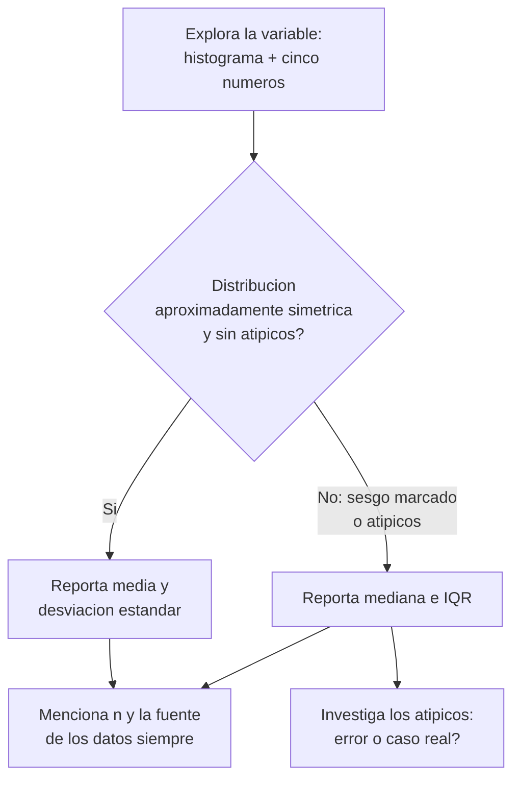
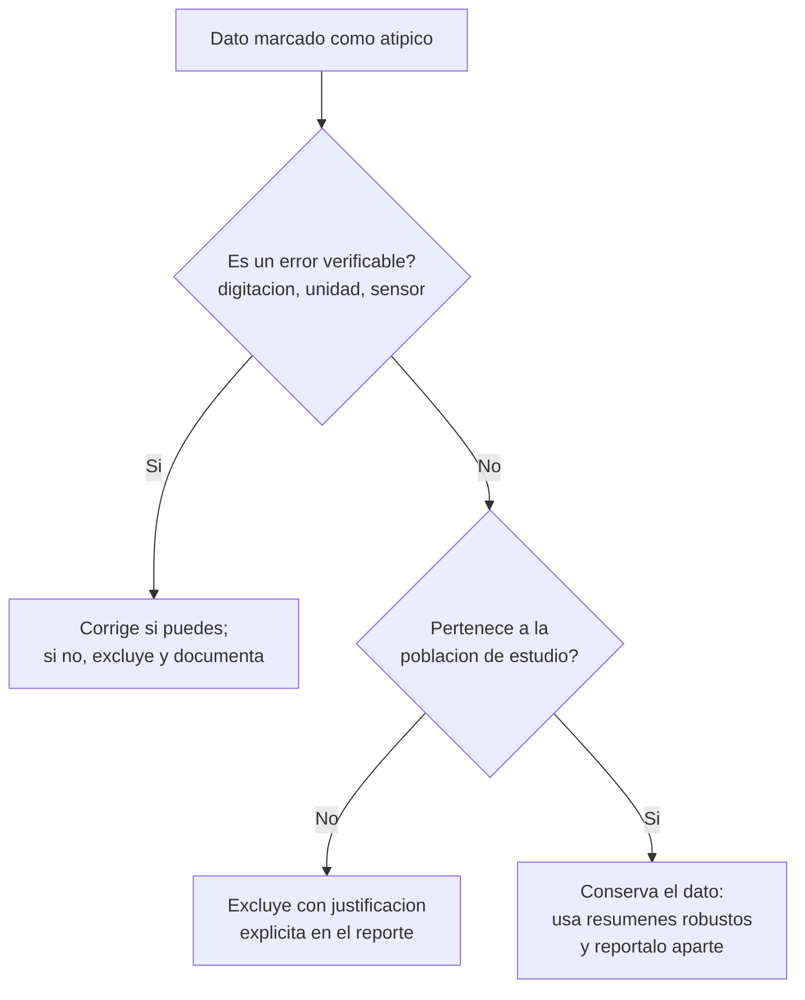

# Estadística descriptiva univariada

## Por qué importa esta unidad

En u1 aprendiste a clasificar variables, a distinguir población de muestra y a
reconocer cómo se recolectan los datos. Ahora tienes una columna de números
frente a ti —salarios, tiempos de espera, calificaciones— y la pregunta es
inevitable: **¿cómo resumo cientos o miles de valores en dos o tres cifras que
digan la verdad?**

Esa es la tarea de la estadística descriptiva univariada: comprimir una
variable cuantitativa en medidas de **posición** (¿dónde está el centro? ¿dónde
están los cuartos de la distribución?) y de **dispersión** (¿qué tan esparcidos
están los datos alrededor de ese centro?). Pero comprimir implica decidir, y
decidir mal produce resúmenes engañosos: el salario "promedio" de una empresa
donde el gerente gana cinco veces más que todos los demás no describe a nadie.
Por eso esta unidad no solo te enseña a calcular, sino a **elegir** el resumen
correcto según la forma de la distribución y la presencia de valores atípicos.

Al terminar esta unidad podrás:

1. **Calcular e interpretar medidas de posición** (media, mediana, moda,
   percentiles) para una variable.
2. **Calcular e interpretar medidas de dispersión** (rango, varianza,
   desviación estándar, IQR).
3. **Elegir el resumen apropiado** (media vs. mediana, $\sigma$ vs. IQR) según
   la forma y los atípicos de la distribución.
4. **Detectar valores atípicos** con la regla de $1.5 \cdot \text{IQR}$ y el
   z-score.

Conceptos clave que dominarás: *robustez, asimetría, curtosis, estandarización,
resumen de cinco números*.

## Mapa de ruta de la unidad

| Sección | Tema | Horas est. | Prerrequisitos internos |
|---|---|---|---|
| 1 | De los datos crudos al resumen: notación y datasets de trabajo | 0.5 h | u1 (tipos de variables, muestra vs. población) |
| 2 | Medidas de posición central: media, mediana y moda | 1.5 h | Sección 1 |
| 3 | Percentiles, cuartiles y el resumen de cinco números | 1.5 h | Sección 2 |
| 4 | Medidas de dispersión: rango, varianza, desviación estándar e IQR | 2 h | Secciones 2–3 |
| 5 | Forma de la distribución y elección del resumen apropiado | 1 h | Secciones 2–4 |
| 6 | Detección de valores atípicos: regla 1.5·IQR y z-score | 1 h | Secciones 3–5 |
| — | Ejercicios + capstone | 0.5 h | Todas |

---

## 1. De los datos crudos al resumen: notación y datasets de trabajo

Antes de calcular nada, fijemos el lenguaje. Recuerda de u1 que un
**parámetro** describe a la población completa y un **estadístico** describe a
la muestra. La estadística descriptiva calcula estadísticos; la notación
distingue ambos mundos y la usaremos durante todo el curso:

| Medida | En la muestra (estadístico) | En la población (parámetro) |
|---|---|---|
| Tamaño | $n$ | $N$ |
| Media | $\bar{x}$ ("x barra") | $\mu$ (mu) |
| Varianza | $s^2$ | $\sigma^2$ (sigma cuadrado) |
| Desviación estándar | $s$ | $\sigma$ |

Los valores individuales de la variable se escriben $x_1, x_2, \dots, x_n$, y
el símbolo $\sum$ (sigma mayúscula) indica suma:
$\sum_{i=1}^{n} x_i = x_1 + x_2 + \cdots + x_n$.

Todas las medidas de esta unidad aplican a **variables cuantitativas** (la
moda es la única que también funciona con cualitativas). Si tu variable es
nominal u ordinal, la mayoría de lo que sigue no tiene sentido: no existe "el
promedio de los distritos de residencia".

A lo largo de la unidad usaremos dos datasets de trabajo. Calcula todo a mano
con ellos al menos una vez; la fluidez manual es la base de la intuición.

**Dataset A — Salarios** (miles de soles mensuales) de los $n = 10$ empleados
de una empresa pequeña, ya ordenados:

$$2.1,\; 2.3,\; 2.5,\; 2.5,\; 2.8,\; 3.0,\; 3.2,\; 3.5,\; 3.8,\; 12.0$$

(El 12.0 es el gerente general. Guárdale recelo: va a distorsionar varias
medidas.)

**Dataset B — Tiempos de atención** (minutos) de $n = 20$ pacientes en una
clínica, ya ordenados:

$$3,\,5,\,6,\,7,\,8,\,8,\,9,\,10,\,10,\,11,\,12,\,12,\,13,\,14,\,15,\,16,\,17,\,19,\,22,\,30$$

> **Checkpoint 1** (respuestas al final de la unidad)
>
> 1.1 ¿Qué símbolo usa la media muestral y cuál la media poblacional?
>
> 1.2 ¿Por qué no tiene sentido calcular la media de una variable nominal?

---

## 2. Medidas de posición central: media, mediana y moda

Una medida de posición central (o de tendencia central) responde: *si tuviera
que resumir toda la variable en un solo número "típico", ¿cuál sería?* Hay
tres respuestas clásicas, y cada una define "típico" de manera distinta.

### 2.1 La media aritmética: el punto de equilibrio

La **media** es la suma de todos los valores dividida entre cuántos son:

$$\bar{x} = \frac{1}{n}\sum_{i=1}^{n} x_i = \frac{x_1 + x_2 + \cdots + x_n}{n}$$

Interpretación física: si colocas los datos como pesas idénticas sobre una
regla, la media es el punto donde la regla queda en equilibrio. Esa imagen
explica su mayor virtud y su mayor defecto: **usa toda la información** (cada
valor contribuye), pero precisamente por eso **un solo valor extremo la
arrastra** hacia él, como una pesa colocada muy lejos del centro.

**Ejemplo resuelto (Dataset A).** Suma de los 10 salarios:

$$\sum x_i = 2.1 + 2.3 + 2.5 + 2.5 + 2.8 + 3.0 + 3.2 + 3.5 + 3.8 + 12.0 = 37.7$$

$$\bar{x} = \frac{37.7}{10} = 3.77 \text{ miles de soles}$$

¿Es 3.77 un salario "típico" en esta empresa? No: **9 de los 10 empleados
ganan menos que la media**. El salario del gerente arrastró el punto de
equilibrio hacia arriba. Si lo excluimos, la media de los 9 restantes es
$25.7 / 9 \approx 2.86$: casi un mil de soles menos. Un único dato movió la
media casi 32%.

Una variante útil cuando los valores no pesan igual es la **media ponderada**:

$$\bar{x}_w = \frac{\sum_{i=1}^{n} w_i\, x_i}{\sum_{i=1}^{n} w_i}$$

donde $w_i$ es el peso del valor $i$. Es la fórmula detrás de tu promedio
universitario ponderado por créditos: un curso de 5 créditos con nota 14 y uno
de 2 créditos con nota 18 dan $\bar{x}_w = (5 \cdot 14 + 2 \cdot 18)/(5+2) =
106/7 \approx 15.1$, no el 16 de la media simple.

### 2.2 La mediana: el valor del medio

La **mediana** es el valor que parte los datos ordenados en dos mitades: 50%
queda por debajo y 50% por encima. Para calcularla:

1. Ordena los $n$ valores de menor a mayor.
2. Si $n$ es impar, la mediana es el valor central, el de la posición
   $\frac{n+1}{2}$.
3. Si $n$ es par, es el **promedio de los dos valores centrales** (posiciones
   $\frac{n}{2}$ y $\frac{n}{2}+1$).

**Ejemplo resuelto (Dataset A).** Con $n = 10$ (par), los valores centrales
son el 5.° y el 6.°: $2.8$ y $3.0$.

$$\text{Mediana} = \frac{2.8 + 3.0}{2} = 2.9 \text{ miles de soles}$$

Compara: media $= 3.77$, mediana $= 2.9$. La mediana sí describe a un
empleado típico, porque **no le importa cuánto gana el gerente, solo que está
en la mitad superior**. Si el gerente ganara 120 en lugar de 12, la media
saltaría a $14.57$ pero la mediana seguiría siendo exactamente $2.9$. Esa
inmunidad ante valores extremos se llama **robustez**, y es el criterio
central de la sección 5.

### 2.3 La moda: el valor más frecuente

La **moda** es el valor que más se repite. En el Dataset A la moda es $2.5$
(aparece dos veces; ningún otro valor se repite). Sus particularidades:

- Es la **única** medida de centro válida para variables cualitativas: "la
  carrera más demandada fue Medicina" es una moda.
- Puede no existir (si ningún valor se repite) o haber varias: una
  distribución con dos picos es **bimodal**, lo que suele delatar dos
  subpoblaciones mezcladas (p. ej., tiempos de atención de consultas simples
  vs. complejas).
- En variables continuas con muchos decimales casi nunca hay repeticiones
  exactas; ahí la moda se estima como el intervalo más alto del histograma
  (la **clase modal**), tema que retomarás en u3.

::video{src="https://www.youtube.com/watch?v=kn83BA7cRNM" caption="Crash Course Statistics #3 — Media, mediana y moda (EN, ~12 min): la mejor exposición visual de por qué la mediana resiste valores extremos y la media no."}

### 2.4 Las tres medidas en una frase

- **Media**: punto de equilibrio; usa todos los valores; sensible a extremos.
- **Mediana**: punto medio del orden; ignora magnitudes extremas; robusta.
- **Moda**: valor más frecuente; única opción para datos cualitativos.

> **Checkpoint 2**
>
> 2.1 En el Dataset A, ¿por qué la media (3.77) es mayor que la mediana (2.9)?
> ¿Qué dato es el responsable?
>
> 2.2 Calcula la mediana del Dataset B ($n=20$). Pista: promedia las
> posiciones 10 y 11.
>
> 2.3 Un dataset de marcas de celular vendidas tiene como resumen razonable
> ¿la media, la mediana o la moda? ¿Por qué?

---

## 3. Percentiles, cuartiles y el resumen de cinco números

La mediana parte los datos en dos mitades. Los **percentiles** generalizan la
idea: el percentil $k$ ($P_k$) es el valor que deja **aproximadamente el $k\%$
de los datos por debajo**. La mediana es $P_{50}$. Si tu puntaje en el examen
de admisión está en el percentil 90, superaste a cerca del 90% de los
postulantes — sin importar cuál fue el puntaje en sí.

### 3.1 Cómo calcular un percentil

Para datos ordenados $x_1 \le x_2 \le \cdots \le x_n$, una fórmula estándar
(la de OpenStax) localiza la **posición** del percentil $k$:

$$i = \frac{k}{100}\,(n + 1)$$

- Si $i$ es entero, $P_k$ es el dato en la posición $i$.
- Si $i$ no es entero, se **interpola** entre los datos vecinos: con
  $i = 15.75$, toma el dato 15 y avanza 0.75 de la distancia hacia el dato 16.

**Ejemplo resuelto (Dataset B, $n = 20$).** Percentil 90:

$$i = \frac{90}{100}(20 + 1) = 18.9$$

El dato 18 es $19$ y el dato 19 es $22$, así que

$$P_{90} = 19 + 0.9\,(22 - 19) = 19 + 2.7 = 21.7 \text{ minutos}$$

Interpretación: cerca del 90% de los pacientes esperó menos de 21.7 minutos.
Si la clínica promete "atención en menos de 22 minutos", está prometiendo
sobre el percentil 90, no sobre el promedio — un compromiso mucho más fuerte.

El problema inverso también aparece: *¿en qué percentil está un valor dado?*
Si $x$ valores son menores que el dato y $y$ valores son iguales a él:

$$\text{percentil de un dato} = \frac{x + 0.5\,y}{n} \times 100$$

Para el paciente que esperó 14 minutos en el Dataset B: hay 13 valores
menores y 1 igual (él mismo), entonces $\frac{13 + 0.5}{20} \times 100 =
67.5$: está alrededor del percentil 68.

### 3.2 Cuartiles e IQR

Los **cuartiles** son los percentiles que cortan en cuartos:

- $Q_1 = P_{25}$: el 25% de los datos queda por debajo.
- $Q_2 = P_{50}$: la mediana.
- $Q_3 = P_{75}$: el 75% queda por debajo.

Un método manual simple y muy usado (el de "mitades"): calcula la mediana,
luego $Q_1$ es la mediana de la mitad inferior y $Q_3$ la mediana de la mitad
superior.

**Ejemplo resuelto (Dataset B).** Mediana $= (11 + 12)/2 = 11.5$. Mitad
inferior (10 datos): $3,5,6,7,8,8,9,10,10,11 \Rightarrow Q_1 = (8+8)/2 = 8$.
Mitad superior: $12,12,13,14,15,16,17,19,22,30 \Rightarrow Q_3 = (15+16)/2 =
15.5$.

La distancia entre cuartiles es el **rango intercuartílico**:

$$\text{IQR} = Q_3 - Q_1 = 15.5 - 8 = 7.5 \text{ minutos}$$

El IQR mide el ancho de la franja donde vive el **50% central** de los datos.
Como solo depende de posiciones de orden (igual que la mediana), es robusto:
los extremos pueden moverse cuanto quieran sin alterarlo.

> **Nota práctica:** existen varias convenciones para calcular cuartiles
> (interpolación, mitades, exclusión de la mediana...). Excel, R y Python
> pueden dar valores ligeramente distintos para los mismos datos. Para esta
> unidad usa el método de mitades a mano y no te alarmes si el software
> difiere en decimales: la interpretación no cambia.

### 3.3 El resumen de cinco números

El **resumen de cinco números** condensa la distribución completa en:

$$\big(\min,\; Q_1,\; \text{mediana},\; Q_3,\; \max\big)$$

Para el Dataset B: $(3,\; 8,\; 11.5,\; 15.5,\; 30)$. De un vistazo sabes:
nadie esperó menos de 3 minutos, la mitad central esperó entre 8 y 15.5, el
caso típico fue 11.5 y hubo al menos un caso extremo de 30. Este quinteto es
exactamente lo que dibuja el **boxplot** que construirás en u3 — aquí
fabricamos el insumo, allá lo graficaremos.

> **Checkpoint 3**
>
> 3.1 Tu puntaje está en el percentil 35 de un examen nacional. ¿Qué significa
> exactamente? ¿Significa que respondiste bien el 35% de las preguntas?
>
> 3.2 Calcula el resumen de cinco números del Dataset A (usa el método de
> mitades para los cuartiles).
>
> 3.3 ¿Por qué el IQR es robusto ante valores extremos y el rango no?

---

## 4. Medidas de dispersión: rango, varianza, desviación estándar e IQR

Dos clínicas pueden tener el mismo tiempo mediano de atención (11.5 minutos)
y ser experiencias totalmente distintas: en una todos esperan entre 10 y 13;
en la otra, entre 2 y 40. El centro no basta; necesitas medir **cuánto se
dispersan los datos**.

### 4.1 El rango: simple y frágil

$$\text{Rango} = \max - \min$$

Dataset B: $30 - 3 = 27$ minutos. Es inmediato de calcular pero depende
*exclusivamente* de los dos valores más extremos — justo los menos confiables.
Un solo error de digitación (300 en vez de 30) multiplica el rango por diez.
Úsalo como primera mirada, nunca como resumen final.

### 4.2 Varianza y desviación estándar: la dispersión promedio

La idea central: medir qué tan lejos está cada dato de la media, en promedio.
La distancia de $x_i$ a la media es la **desviación** $x_i - \bar{x}$. No
podemos simplemente promediarlas porque siempre suman cero (las negativas
cancelan a las positivas: la media es el punto de equilibrio). La solución
clásica es **elevarlas al cuadrado** antes de promediar.

La **varianza muestral**:

$$s^2 = \frac{\sum_{i=1}^{n} (x_i - \bar{x})^2}{n - 1}$$

y la **varianza poblacional** (cuando tienes la población completa):

$$\sigma^2 = \frac{\sum_{i=1}^{N} (x_i - \mu)^2}{N}$$

**¿Por qué $n-1$ y no $n$?** Porque al usar $\bar{x}$ (calculada de los mismos
datos) en lugar de la verdadera $\mu$, las desviaciones quedan
sistemáticamente un poco más pequeñas de lo que serían respecto a $\mu$.
Dividir entre $n-1$ corrige ese encogimiento y hace de $s^2$ un estimador
insesgado de $\sigma^2$. La intuición de "grados de libertad": como las $n$
desviaciones están obligadas a sumar cero, solo $n-1$ de ellas son libres; la
última está determinada por las demás. Este detalle reaparecerá en u7 con la
distribución $t$.

La varianza queda en **unidades al cuadrado** (¿minutos²?), incómodas de
interpretar. Por eso el resumen estrella es su raíz cuadrada, la **desviación
estándar**:

$$s = \sqrt{s^2}, \qquad \sigma = \sqrt{\sigma^2}$$

que vuelve a las unidades originales y se lee como "la distancia típica de un
dato a la media".

**Ejemplo resuelto completo.** Cinco mediciones de un proceso: $4, 6, 6, 8,
11$. Paso a paso:

1. Media: $\bar{x} = \frac{4+6+6+8+11}{5} = \frac{35}{5} = 7$.
2. Desviaciones y cuadrados:

| $x_i$ | $x_i - \bar{x}$ | $(x_i - \bar{x})^2$ |
|---|---|---|
| 4 | $-3$ | 9 |
| 6 | $-1$ | 1 |
| 6 | $-1$ | 1 |
| 8 | $+1$ | 1 |
| 11 | $+4$ | 16 |
| **Suma** | $0$ ✓ | $28$ |

3. Varianza muestral: $s^2 = \frac{28}{5-1} = 7$.
4. Desviación estándar: $s = \sqrt{7} \approx 2.65$.

Lectura: un dato típico de este proceso se aleja unos 2.65 del centro 7.
(Si estos cinco valores fueran *toda* la población, usarías
$\sigma^2 = 28/5 = 5.6$ y $\sigma \approx 2.37$.)

**Ejemplo resuelto (Dataset A).** Con $\bar{x} = 3.77$, la suma de
desviaciones al cuadrado da $\sum (x_i - \bar{x})^2 \approx 77.84$ (verifícalo:
solo el gerente aporta $(12 - 3.77)^2 = 8.23^2 \approx 67.73$, es decir **el
87% de toda la variabilidad**). Entonces:

$$s^2 = \frac{77.84}{9} \approx 8.65, \qquad s \approx 2.94$$

Una desviación estándar de 2.94 en una empresa donde casi todos ganan entre
2.1 y 3.8 es claramente absurda como "distancia típica". Igual que la media,
$s$ **no es robusta**: elevar al cuadrado amplifica brutalmente a los
extremos. Sin el gerente, $s$ de los 9 restantes es apenas $\approx 0.58$.

::video{src="https://www.youtube.com/watch?v=R4yfNi_8Kqw" caption="Crash Course Statistics #4 — Medidas de dispersión (EN, ~11 min): rango, IQR, varianza y desviación estándar, y cómo los atípicos distorsionan cada una."}

### 4.3 IQR como medida de dispersión robusta

El IQR de la sección 3 es la contraparte robusta de $s$: mide el ancho del 50%
central y los extremos no lo tocan. En el Dataset A: $Q_1 = 2.5$, $Q_3 = 3.5$
(medianas de cada mitad de 5 datos), $\text{IQR} = 1.0$. Compara la historia
que cuentan: "dispersión típica de 2.94" ($s$, distorsionada) vs. "el 50%
central de los salarios cabe en una franja de 1.0" (IQR, fiel).

### 4.4 Comparar dispersiones: el coeficiente de variación

¿Es más variable un salario con $s = 600$ soles o un tiempo de espera con
$s = 5$ minutos? Imposible compararlos directamente: unidades distintas. El
**coeficiente de variación** expresa la dispersión como fracción de la media:

$$CV = \frac{s}{\bar{x}}$$

(a menudo reportado como porcentaje). Por ejemplo, si unos salarios tienen
$\bar{x} = 3000$ y $s = 600$, $CV = 0.20$; si unos tiempos de espera tienen
$\bar{x} = 12$ y $s = 6$, $CV = 0.50$: los tiempos son relativamente más
variables, aunque su $s$ sea menor en valor absoluto.

> **Checkpoint 4**
>
> 4.1 ¿Por qué las desviaciones $x_i - \bar{x}$ siempre suman cero, y cómo
> resuelve eso la varianza?
>
> 4.2 Calcula $s$ para los datos $2, 4, 6, 8, 10$ (pista: $\bar{x} = 6$, la
> suma de cuadrados es 40).
>
> 4.3 Si conviertes el Dataset B de minutos a segundos (multiplicar todo por
> 60), ¿qué pasa con la media, con $s$ y con el CV?

---

## 5. Forma de la distribución y elección del resumen apropiado

Ya tienes dos pares de herramientas: (media, $s$) y (mediana, IQR). La
pregunta de esta sección —el objetivo 3 de la unidad— es **cuándo usar cada
par**. La respuesta depende de la *forma* de la distribución.

### 5.1 Asimetría (sesgo)

Una distribución es **simétrica** si su mitad izquierda es espejo de la
derecha (como la campana que estudiarás en u5). Es **asimétrica a la derecha**
(sesgo positivo) si tiene una cola larga hacia los valores altos —ingresos,
precios de viviendas, tiempos de espera— y **asimétrica a la izquierda**
(sesgo negativo) si la cola apunta a los valores bajos —edad de muerte,
calificaciones en un examen fácil.

La posición relativa de media y mediana delata el sesgo, porque la cola
arrastra a la media pero no a la mediana:

- Cola a la derecha $\Rightarrow$ media $>$ mediana (Dataset A: $3.77 > 2.9$).
- Cola a la izquierda $\Rightarrow$ media $<$ mediana.
- Simétrica $\Rightarrow$ media $\approx$ mediana.

(Esta regla empírica funciona en la gran mayoría de los casos prácticos,
aunque existen contraejemplos con distribuciones multimodales o discretas.)

Para cuantificar la asimetría existe el **coeficiente de asimetría** de
Fisher, que promedia las desviaciones estandarizadas al cubo:

$$g_1 = \frac{\frac{1}{n}\sum_{i=1}^{n}(x_i - \bar{x})^3}{s^3}$$

El cubo conserva el signo: desviaciones grandes positivas (cola derecha)
producen $g_1 > 0$; cola izquierda, $g_1 < 0$; simetría, $g_1 \approx 0$. No
necesitas calcularlo a mano en este curso, pero sí leerlo: el software lo
reporta como `skewness`.

### 5.2 Curtosis

La **curtosis** mide el peso de las colas de la distribución comparado con la
campana normal: promedia las desviaciones estandarizadas a la cuarta potencia,

$$g_2 = \frac{\frac{1}{n}\sum_{i=1}^{n}(x_i - \bar{x})^4}{s^4} - 3$$

El "$-3$" calibra contra la distribución normal, de modo que:

- $g_2 \approx 0$: colas como la normal (**mesocúrtica**).
- $g_2 > 0$: colas pesadas, más valores extremos de lo normal
  (**leptocúrtica**). Típico de rendimientos financieros.
- $g_2 < 0$: colas livianas, datos muy concentrados sin extremos
  (**platicúrtica**).

Para esta unidad basta la lectura cualitativa: curtosis alta es una señal de
alerta de que la media y $s$ pueden estar dominadas por unos pocos valores
extremos, y de que conviene revisar atípicos (sección 6).

### 5.3 Robustez: el criterio de decisión

Una medida es **robusta** si unos pocos valores extremos o atípicos no la
alteran sustancialmente. El balance de lo aprendido:

| | Posición | Dispersión |
|---|---|---|
| **No robustas** (usan magnitudes de todos los datos) | media $\bar{x}$ | $s$, $s^2$, rango |
| **Robustas** (usan posiciones de orden) | mediana, percentiles | IQR |

La regla de decisión profesional:

¿Por qué no usar siempre mediana e IQR, si son más seguras? Porque cuando la
distribución sí es simétrica y limpia, la media y $s$ aprovechan **toda** la
información de los datos (son más *eficientes*: con la misma muestra estiman
el centro con menos error) y son la puerta de entrada a casi toda la
inferencia de u6–u10. La mediana/IQR es el plan B robusto, no el estándar
universal.

**Caso resuelto.** Un periodista quiere reportar "el salario típico" de la
empresa del Dataset A. Diagnóstico: media $3.77 >$ mediana $2.9$ (sesgo a la
derecha) y un valor sospechosamente lejano (12.0). Decisión: reportar
**mediana 2.9 e IQR 1.0**, y mencionar aparte que existe un salario directivo
de 12.0. Si reportara la media, el titular "el empleado típico gana 3,770
soles" sería falso para 9 de los 10 empleados. La elección del estadístico es
también una decisión ética de comunicación.

> **Checkpoint 5**
>
> 5.1 En cierta ciudad, el precio medio de las viviendas es \$285,000 y el
> mediano \$210,000. ¿Qué forma tiene la distribución y cuál medida
> reportarías?
>
> 5.2 ¿Qué significa que la mediana sea "robusta" y la media no?
>
> 5.3 ¿Qué indica una curtosis muestral claramente positiva sobre la
> conveniencia de usar $s$?

---

## 6. Detección de valores atípicos: regla 1.5·IQR y z-score

Un **valor atípico** (*outlier*) es una observación anormalmente alejada del
resto. Puede ser un error (digitaron 300 en vez de 30), un caso de otra
población (el gerente entre los operarios) o un hallazgo genuino e
interesante (el paciente cuya atención se complicó). Detectarlos es mecánico;
**decidir qué hacer con ellos es análisis**. Nunca borres un atípico solo por
serlo: primero investiga su origen.

### 6.1 Método 1: la regla de 1.5·IQR (cercas de Tukey)

Construye dos "cercas" a partir de los cuartiles:

$$\text{Cerca inferior} = Q_1 - 1.5 \cdot \text{IQR}$$
$$\text{Cerca superior} = Q_3 + 1.5 \cdot \text{IQR}$$

Todo dato fuera de las cercas se marca como atípico. Como se basa en
cuartiles, el método es **robusto**: los propios atípicos no mueven las
cercas.

**Ejemplo resuelto (Dataset B).** Con $Q_1 = 8$, $Q_3 = 15.5$,
$\text{IQR} = 7.5$:

$$\text{Cerca inferior} = 8 - 1.5(7.5) = 8 - 11.25 = -3.25$$
$$\text{Cerca superior} = 15.5 + 1.5(7.5) = 15.5 + 11.25 = 26.75$$

Ningún tiempo puede ser negativo, así que no hay atípicos bajos. Por arriba,
$30 > 26.75$: el paciente de 30 minutos **es atípico**; el de 22 no lo es.

**Ejemplo resuelto (Dataset A).** $Q_1 = 2.5$, $Q_3 = 3.5$, $\text{IQR} = 1.0$:
cercas en $2.5 - 1.5 = 1.0$ y $3.5 + 1.5 = 5.0$. El salario del gerente,
$12.0 > 5.0$, queda marcado con holgura.

(El factor 1.5 es una convención propuesta por John Tukey que funciona bien
en la práctica; algunos textos llaman "atípico extremo" a lo que excede
$3 \cdot \text{IQR}$ desde los cuartiles.)

### 6.2 Método 2: el z-score (estandarización)

El **z-score** de un dato mide a cuántas desviaciones estándar está de la
media:

$$z_i = \frac{x_i - \bar{x}}{s} \qquad \text{(o } z = \frac{x - \mu}{\sigma} \text{ en la población)}$$

Esta transformación se llama **estandarización**: convierte cualquier
variable a una escala común sin unidades, con media 0 y desviación estándar 1.
Lectura directa: $z = 2$ significa "dos desviaciones estándar por encima de la
media"; $z = -1.5$, "una y media por debajo". La regla habitual marca como
atípico todo dato con

$$|z| > 3$$

(algunos textos usan 2 como umbral de "inusual"). En u5 verás que, bajo la
campana normal, menos del 0.3% de los datos supera $|z| = 3$ — de ahí el
umbral.

**Ejemplo resuelto: comparar escalas distintas.** Ana obtuvo 85 en un examen
con $\bar{x} = 70$, $s = 10$; Luis obtuvo 90 en otro examen con
$\bar{x} = 80$, $s = 8$. ¿Quién rindió mejor *relativamente*?

$$z_{\text{Ana}} = \frac{85 - 70}{10} = 1.5 \qquad z_{\text{Luis}} = \frac{90 - 80}{8} = 1.25$$

Ana, aunque su puntaje bruto es menor: está más arriba dentro de su propia
distribución. Esta capacidad de comparar peras con manzanas es la gran virtud
de la estandarización y la usarás constantemente desde u5.

**Ejemplo resuelto (Dataset A): cuando el z-score falla.** El salario del
gerente: con $\bar{x} = 3.77$ y $s = 2.94$,

$$z_{\text{gerente}} = \frac{12.0 - 3.77}{2.94} \approx 2.80$$

¡Menos de 3! El criterio $|z| > 3$ **no lo marca como atípico**, mientras que
la regla 1.5·IQR lo marcaba con holgura. ¿Por qué? Porque el propio gerente
infló $\bar{x}$ y sobre todo $s$ (aportaba el 87% de la suma de cuadrados):
el atípico **se camufla a sí mismo** agrandando la vara con que se le mide.
Este fenómeno se llama *enmascaramiento* y es la lección clave de la sección:

- **Regla 1.5·IQR**: robusta, preferible en muestras pequeñas o sesgadas; es
  la que usa el boxplot.
- **Z-score**: simple e interpretable, pero usa $\bar{x}$ y $s$, que los
  mismos atípicos distorsionan; funciona mejor en muestras grandes y
  aproximadamente simétricas.

### 6.3 Protocolo ante un atípico detectado

La regla de oro: **toda exclusión se documenta**. Un análisis donde los
atípicos desaparecen en silencio no es reproducible ni honesto — principio
que será central en el flujo de trabajo de u12.

> **Checkpoint 6**
>
> 6.1 Calcula las cercas de Tukey para un dataset con $Q_1 = 40$ y $Q_3 = 60$.
> ¿Es atípico un valor de 95?
>
> 6.2 Un dato tiene $z = -2.4$. Tradúcelo a palabras.
>
> 6.3 ¿Por qué la regla 1.5·IQR detectó al gerente del Dataset A y el
> criterio $|z| > 3$ no?

---

## Ejercicios

Resuélvelos a mano y verifica con calculadora u hoja de cálculo. Las
soluciones no se incluyen a propósito: contrasta con un compañero o con el
software.

**Ejercicio 1 (calentamiento — obj. 1 y 2).** Las notas de un quiz de 9
estudiantes son: $11, 12, 13, 13, 14, 15, 16, 17, 18$. Calcula media,
mediana, moda, rango, varianza muestral y desviación estándar. Comprueba que
las desviaciones respecto a la media suman cero.

**Ejercicio 2 (percentiles — obj. 1).** Con el Dataset B: (a) calcula $P_{10}$
y $P_{80}$ con la fórmula de posición $i = \frac{k}{100}(n+1)$; (b) ¿en qué
percentil aproximado está el paciente que esperó 9 minutos?; (c) escribe una
frase de interpretación para cada resultado dirigida al director de la
clínica.

**Ejercicio 3 (elección de resumen — obj. 3).** Considera este
escenario: los ingresos mensuales de 15 hogares de una cuadra son (en soles)
$1200, 1350, 1400, 1500, 1500, 1600, 1700, 1800, 1900, 2000, 2100, 2300,
2500, 2800, 25000$. (a) Calcula media y mediana; (b) determina la forma de la
distribución; (c) decide qué par (centro, dispersión) reportarías y justifica
en dos líneas; (d) calcula las cercas de Tukey y verifica si el hogar de
25,000 es atípico.

**Ejercicio 4 (z-scores — obj. 4).** En una empresa, el tiempo medio de
respuesta a tickets es $\bar{x} = 4.2$ horas con $s = 1.1$. (a) Calcula el
z-score de un ticket resuelto en 8.0 horas y de otro en 2.0 horas; (b) ¿alguno
califica como atípico con el umbral $|z| > 3$?; (c) un segundo equipo tiene
$\bar{x} = 9.0$ y $s = 3.5$: ¿un ticket de 8.0 horas es relativamente más
lento en el primer equipo o en el segundo?

**Ejercicio 5 (integrador — todos los objetivos).** Inventa un dataset de
$n = 12$ valores donde: la media supere a la mediana en al menos 20%, exista
exactamente un atípico según 1.5·IQR, y ese atípico tenga $|z| < 3$.
Demuestra las tres propiedades con cálculos. (Pista: estudia cómo se
construyó el Dataset A.)

---

## Capstone: radiografía descriptiva de una variable real

**Objetivo:** producir un mini-reporte descriptivo completo y honesto de una
variable cuantitativa real, integrando los cuatro objetivos de la unidad.

**Datos.** Consigue una variable cuantitativa con $n \ge 30$ de una fuente
real: tus gastos diarios del último mes, tiempos de viaje a la universidad,
datos abiertos de tu municipio o del INEI, precios de un producto en distintas
tiendas. Documenta la fuente y el método de recolección (conecta con u1: ¿es
una muestra?, ¿de qué población?, ¿con qué posibles sesgos?).

**Entregable** (1–2 páginas o un notebook):

1. **Contexto** (3–4 líneas): variable, unidades, población objetivo, cómo se
   recolectó.
2. **Tabla de posición**: media, mediana, moda (o clase modal), $P_{10}$,
   $P_{90}$, y el resumen de cinco números.
3. **Tabla de dispersión**: rango, $s^2$, $s$, IQR, CV.
4. **Diagnóstico de forma**: compara media vs. mediana, comenta asimetría (y
   curtosis si tu software la reporta).
5. **Atípicos**: aplica la regla 1.5·IQR **y** el z-score; tabula qué datos
   marca cada método; si difieren, explica por qué (¿enmascaramiento?).
   Investiga el origen de al menos un atípico y decide —con justificación
   escrita— si lo conservas o lo excluyes.
6. **Veredicto** (5 líneas máximo): el par (centro, dispersión) que mejor
   describe tu variable y una frase de interpretación que un lector sin
   formación estadística entienda.

**Criterio de éxito:** otra persona, leyendo solo tu reporte, debería poder
describir la variable con precisión y saber exactamente qué decisiones tomaste
y por qué. Guarda este reporte: en u3 le añadirás histograma y boxplot, y en
u12 será el germen de tu pipeline completo.

---

## Guía de repaso espaciado

**En 1 día** (~20 min):

- Reescribe de memoria las fórmulas de $\bar{x}$, mediana (par/impar), $s^2$,
  $s$, IQR, cercas de Tukey y z-score. Verifica contra la unidad.
- Recalcula media, mediana e IQR del Dataset A sin mirar las soluciones.
- Responde otra vez los checkpoints 2 y 6 sin ver las respuestas.

**En 1 semana** (~30 min):

- Resuelve el Ejercicio 3 desde cero (sin mirar tu solución anterior).
- Explícale a alguien (o a una grabadora) por qué la mediana es robusta y la
  media no, usando el ejemplo del gerente. Si no puedes hacerlo fluido en 2
  minutos, relee la sección 5.
- Mira el video de Crash Course #4 y anota una idea que la unidad no enfatizó.

**En 1 mes** (~30 min):

- Toma una variable nueva cualquiera y produce su resumen de cinco números,
  su diagnóstico de forma y su análisis de atípicos en menos de 20 minutos.
- Pregunta de conexión hacia adelante: en u5 verás que bajo la curva normal
  cerca del 68% de los datos tiene $|z| < 1$ y el 95% tiene $|z| < 2$.
  ¿Cómo refina eso el umbral $|z| > 3$ que usaste aquí?
- Repasa el quiz de la unidad; cualquier pregunta fallada indica la sección a
  releer.

---

## Respuestas a los checkpoints

**1.1** Muestral: $\bar{x}$. Poblacional: $\mu$.

**1.2** Las categorías nominales no tienen orden ni magnitud numérica; sumar
y dividir "distritos" no produce nada interpretable. Solo la moda aplica.

**2.1** El salario del gerente (12.0) arrastra la media hacia arriba porque
la media usa la magnitud de todos los valores; la mediana solo usa el orden,
así que queda en 2.9. La diferencia delata el sesgo a la derecha.

**2.2** Posiciones 10 y 11 del Dataset B: $11$ y $12$. Mediana
$= (11+12)/2 = 11.5$ minutos.

**2.3** La moda: "marca de celular" es una variable cualitativa nominal;
media y mediana no están definidas para ella.

**3.1** Significa que aproximadamente el 35% de los postulantes obtuvo un
puntaje menor que el tuyo. No dice nada sobre el porcentaje de respuestas
correctas: es una medida de posición relativa, no de desempeño absoluto.

**3.2** Dataset A: $\min = 2.1$; mitad inferior $2.1, 2.3, 2.5, 2.5, 2.8
\Rightarrow Q_1 = 2.5$; mediana $= 2.9$; mitad superior $3.0, 3.2, 3.5, 3.8,
12.0 \Rightarrow Q_3 = 3.5$; $\max = 12.0$. Resumen:
$(2.1, 2.5, 2.9, 3.5, 12.0)$.

**3.3** El IQR depende solo de $Q_1$ y $Q_3$, posiciones del orden interior
de los datos: mover el máximo de 12 a 1200 no los altera. El rango se calcula
directamente con el mínimo y el máximo, los valores más extremos posibles.

**4.1** Porque la media es el punto de equilibrio: la suma de distancias por
debajo iguala exactamente a la suma por encima, $\sum(x_i - \bar{x}) = 0$. La
varianza eleva las desviaciones al cuadrado, volviéndolas todas positivas
antes de promediar.

**4.2** $s^2 = 40/(5-1) = 10$, $s = \sqrt{10} \approx 3.16$.

**4.3** La media y $s$ quedan multiplicadas por 60 (ambas heredan los cambios
de escala lineales). El CV no cambia: $\frac{60s}{60\bar{x}} = \frac{s}{\bar{x}}$;
por eso sirve para comparar entre unidades distintas.

**5.1** Media $>$ mediana $\Rightarrow$ asimetría a la derecha (pocas
viviendas muy caras estiran la cola). Reportarías la mediana (con el IQR),
como de hecho hacen los reportes inmobiliarios serios.

**5.2** Que unos pocos valores extremos no la alteran sustancialmente: puedes
deformar las colas sin mover la mediana. La media incorpora la magnitud de
cada dato, así que un solo extremo la desplaza.

**5.3** Curtosis positiva = colas pesadas = presencia frecuente de valores
extremos que inflan $s$ vía los cuadrados. Es una señal para preferir el IQR
o, al menos, revisar atípicos antes de confiar en $s$.

**6.1** $\text{IQR} = 20$; cercas en $40 - 30 = 10$ y $60 + 30 = 90$. Un
valor de 95 excede la cerca superior: sí es atípico.

**6.2** El dato está 2.4 desviaciones estándar **por debajo** de la media.
Inusualmente bajo, aunque no atípico bajo el umbral estricto $|z| > 3$.

**6.3** Porque el z-score se calcula con $\bar{x}$ y $s$, y el propio gerente
infló ambas (sobre todo $s$, a la que aportaba el 87% de la suma de
cuadrados): el atípico agranda la vara con que se le mide (enmascaramiento).
Las cercas de Tukey usan cuartiles, que el extremo no puede mover.

---

## Para profundizar

Fuentes 100% libres y verificadas. El texto de esta unidad es autocontenido;
estos enlaces son para ampliar, no para suplir.

**Lecturas en español:**

- [OpenStax — 2.5 Medidas del centro de los datos](https://openstax.org/books/introducci%C3%B3n-estad%C3%ADstica/pages/2-5-medidas-del-centro-de-los-datos) — media, mediana y moda con más ejemplos resueltos y datos agrupados (CC BY).
- [OpenStax — 2.3 Medidas de la ubicación de los datos](https://openstax.org/books/introducci%C3%B3n-estad%C3%ADstica/pages/2-3-medidas-de-la-ubicacion-de-los-datos) — percentiles, cuartiles e IQR, con la fórmula de interpolación usada aquí (CC BY).
- [OpenStax — 2.7 Medidas de la dispersión de los datos](https://openstax.org/books/introducci%C3%B3n-estad%C3%ADstica/pages/2-7-medidas-de-la-dispersion-de-los-datos) — varianza y desviación estándar, fórmulas muestral vs. poblacional en detalle (CC BY).
- [LibreTexts ES — Cap. 02: Estadística Descriptiva](https://espanol.libretexts.org/Bookshelves/Estadisticas/Estadisticas_Introductorias/Libro:_Estad%C3%ADsticas_Introductorias_(OpenStax)/02:_Estad%C3%ADstica_Descriptiva) — espejo navegable del capítulo completo de OpenStax con baterías de ejercicios resueltos (CC BY 4.0).
- [LibreTexts ES — 2.8: Medidas de la difusión de los datos](https://espanol.libretexts.org/Bookshelves/Estadisticas/Estadisticas_Introductorias/Libro:_Estad%C3%ADsticas_Introductorias_(OpenStax)/02:_Estad%C3%ADstica_Descriptiva/2.08:_Medidas_de_la_difusi%C3%B3n_de_los_datos) — incluye instrucciones paso a paso de calculadora para $s$ (CC BY 4.0).
- [LibreTexts ES (Geraghty) — 3.5: Trabajar con valores atípicos](https://espanol.libretexts.org/Estadisticas/Estadisticas_Introductorias/Libro:_Estad%C3%ADstica_inferencial_y_probabilidad_-_Un_enfoque_hol%C3%ADstico_(Geraghty)/03:_Estad%C3%ADstica_Descriptiva/3.05:_Trabajar_con_valores_at%C3%ADpicos) — cercas de Tukey y método z-score con ejemplos; proviene de un libro de inferencia, pero la sección es puramente descriptiva (CC BY-SA 4.0).
- [Estadística descriptiva — Luis Rincón, Facultad de Ciencias UNAM](https://docencia.fciencias.unam.mx/lars/ci/descriptiva/descriptiva.html) — tratamiento universitario riguroso de todas las medidas de esta unidad, incluidas asimetría y curtosis con sus fórmulas completas.

**Lectura en inglés (canónica):**

- [OpenIntro Statistics, 4.ª ed. — cap. 2 "Summarizing Data"](https://www.openintro.org/book/os/) — PDF gratuito; la referencia canónica para robustez, boxplots y detección de atípicos; recomendado si lees inglés.

**Videos (en inglés — no existe video verificado en español para esta unidad;
los dos primeros están incrustados arriba):**

- [Crash Course Statistics #3 — Mean, Median, and Mode](https://www.youtube.com/watch?v=kn83BA7cRNM) — robustez de la mediana ante extremos (~12 min).
- [Crash Course Statistics #4 — Measures of Spread](https://www.youtube.com/watch?v=R4yfNi_8Kqw) — rango, IQR, varianza, $s$ y la distorsión por atípicos (~11 min).
- [StatQuest — Calculating the Mean, Variance and Standard Deviation](https://www.youtube.com/watch?v=SzZ6GpcfoQY) — la intuición del $n-1$ explicada despacio.
- [StatQuest — Quantiles and Percentiles](https://www.youtube.com/watch?v=IFKQLDmRK0Y) — percentiles y cuantiles desde cero.
