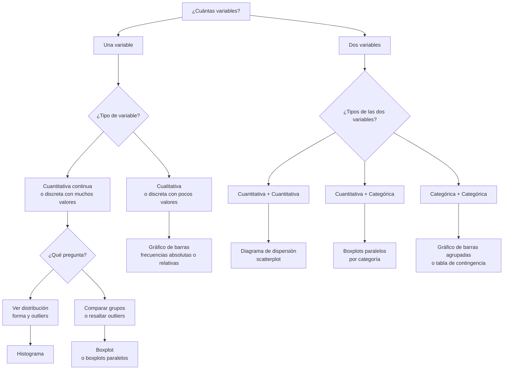
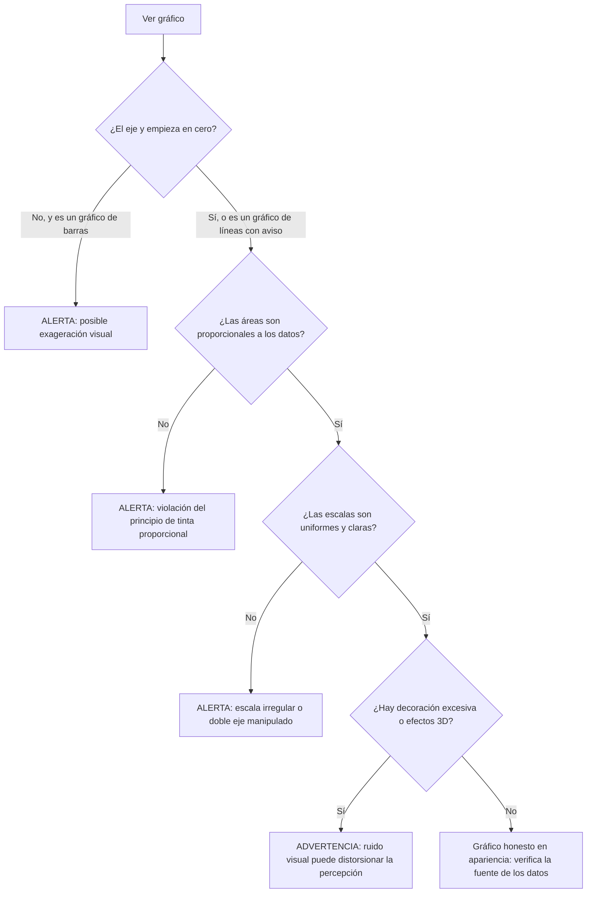

# Visualización de datos

## Por qué importa esta unidad

En u2 aprendiste a comprimir una variable en un puñado de números: media, mediana, IQR, resumen de cinco números. Esas cifras son poderosas, pero tienen un límite que Francis Anscombe demostró en 1973 con un experimento célebre: tomó cuatro conjuntos de datos que comparten casi exactamente la misma media, la misma varianza y el mismo coeficiente de correlación. Pero cuando los graficó, resultaron ser radicalmente distintos: uno lineal, uno curvo, uno con un atípico masivo, uno donde todos los puntos son idénticos salvo uno.

Los números resumen engañaron. La gráfica reveló la verdad.

Eso no significa que los números sean malos. Significa que **los números y los gráficos son complementarios**: uno sin el otro te ciega a la mitad de la historia. Esta unidad te enseña a construir los gráficos que todo analista de datos necesita, a elegir el correcto según el tipo de dato y la pregunta, y —tan importante como construirlos— a **leerlos honestamente** y detectar cuándo alguien los ha diseñado para engañarte.

Al terminar esta unidad podrás:

1. **Construir e interpretar histogramas, boxplots, gráficos de barras y diagramas de dispersión** a partir de datos reales.
2. **Seleccionar el gráfico adecuado** según el tipo de variable y la pregunta de análisis.
3. **Detectar visualizaciones engañosas** (ejes truncados, áreas desproporcionadas, tinta desperdiciada) y proponer correcciones.

Conceptos clave que dominarás: *elección de bins, percepción visual, ejes truncados, razón tinta/datos (Tufte).*

> **Nota sobre los videos de esta unidad.** No existe video libre verificado en español que cubra los contenidos de esta unidad con la profundidad requerida. Los dos videos embebidos son de CrashCourse Statistics en inglés; ambos están disponibles con subtítulos en español activando los CC de YouTube.

---

## Mapa de ruta de la unidad

| Sección | Tema | Horas est. | Prerrequisitos internos |
|---|---|---|---|
| 1 | De la tabla al gráfico: por qué visualizar | 0.5 h | u2 (medidas de posición y dispersión) |
| 2 | Histogramas: construcción, bins y formas de distribución | 1.5 h | Sección 1; u2 (asimetría, IQR) |
| 3 | Boxplots: del resumen de cinco números al diagrama | 1 h | Sección 2; u2 (cercas de Tukey) |
| 4 | Gráficos de barras y variables categóricas | 0.5 h | Sección 1; u1 (tipos de variables) |
| 5 | Diagramas de dispersión: dos variables cuantitativas | 0.5 h | Sección 1; u1 (variables continuas) |
| 6 | Elegir el gráfico correcto | 0.5 h | Secciones 2–5 |
| 7 | Visualizaciones engañosas y honestidad gráfica | 1 h | Secciones 2–6 |
| — | Ejercicios + capstone | 0.5 h | Todas |

---

## 1. De la tabla al gráfico: por qué visualizar

### El cuarteto de Anscombe

Considera los cuatro conjuntos de datos de Anscombe. Aquí están sus estadísticos descriptivos (los que calculaste en u2):

| Estadístico | Conj. I | Conj. II | Conj. III | Conj. IV |
|---|---|---|---|---|
| Media de $x$ | 9.0 | 9.0 | 9.0 | 9.0 |
| Media de $y$ | 7.5 | 7.5 | 7.5 | 7.5 |
| Varianza de $x$ | 11.0 | 11.0 | 11.0 | 11.0 |
| Varianza de $y$ | 4.12 | 4.13 | 4.12 | 4.12 |

Cuatro conjuntos prácticamente idénticos en sus resúmenes numéricos. Sin embargo, cuando se grafican como diagramas de dispersión, revelan patrones completamente distintos:

- **Conjunto I:** relación lineal positiva limpia.
- **Conjunto II:** relación perfectamente curva (cuadrática); la línea recta es el modelo equivocado.
- **Conjunto III:** relación lineal casi perfecta, pero con un atípico masivo que distorsionó todos los estadísticos.
- **Conjunto IV:** once puntos con el mismo valor de $x$, más un único punto outlier que "creó" la correlación.

La moraleja es concreta: **antes de calcular cualquier estadístico, grafica los datos**. Una media, una desviación estándar o una correlación son resúmenes de *algo*, pero si no sabes qué forma tiene ese algo, el número puede engañarte.

### Cómo funciona nuestra percepción visual

El gráfico no es solo "bonito": explota cómo el cerebro humano procesa información. Los psicólogos Cleveland y McGill midieron en los años 1980s qué canales visuales transmiten información cuantitativa con más precisión, de mayor a menor:

1. **Posición a lo largo de un eje común** — el más preciso (barras en un mismo eje, puntos en un scatter)
2. **Longitud** (barras sin eje compartido)
3. **Ángulo/inclinación** (gráfico de torta; menos preciso que barras)
4. **Área** (burbujas, treemaps; el cerebro subestima sistemáticamente áreas grandes)
5. **Color/tono** — el menos preciso para cantidades; útil para categorías

Esta jerarquía explica por qué los gráficos de barras transmiten diferencias con más precisión que los de torta, y por qué los gráficos de burbujas son tan difíciles de leer cuantitativamente. Usaremos esta jerarquía como criterio de elección en la Sección 6.

> **Checkpoint 1** (respuestas al final de la unidad)
>
> 1.1 ¿Qué demostró el cuarteto de Anscombe sobre los estadísticos descriptivos?
>
> 1.2 Según la jerarquía de Cleveland-McGill, ¿qué canal visual es más preciso para transmitir cantidades: la longitud de una barra o el ángulo de una torta?
>
> 1.3 Tienes datos de salarios de u2 (Dataset A). Antes de graficar, ¿qué característica esperarías ver en el gráfico, dado el valor atípico de 12.0?

---

## 2. Histogramas: construcción, bins y formas de distribución

### Qué es un histograma y para qué sirve

El histograma es el gráfico de referencia para **variables cuantitativas continuas** (y para discretas con muchos valores posibles). Su objetivo es mostrar la **distribución de frecuencias**: dónde se concentran los datos, qué tan dispersos están, si hay valores extremos y qué forma tiene la distribución.

Un histograma divide el rango de la variable en intervalos consecutivos llamados **bins** (clases o celdas) y dibuja una barra cuya altura representa cuántos datos caen en cada bin. Es visualmente parecido a un gráfico de barras, pero hay diferencias fundamentales que exploramos en la Sección 4.

### Cómo se construye paso a paso

Trabajemos con el Dataset B de u2: tiempos de atención de $n = 20$ pacientes en una clínica (en minutos):

$$3,\,5,\,6,\,7,\,8,\,8,\,9,\,10,\,10,\,11,\,12,\,12,\,13,\,14,\,15,\,16,\,17,\,19,\,22,\,30$$

**Paso 1: Determinar el rango.** El valor mínimo es 3 y el máximo es 30, así que el rango es $30 - 3 = 27$ minutos.

**Paso 2: Elegir el número de bins.** Esta es la decisión más importante del histograma. La regla más usada en introductorios es la **regla de la raíz cuadrada**: número de bins $\approx \sqrt{n}$. Con $n = 20$:

$$k \approx \sqrt{20} \approx 4.5 \rightarrow \text{usaremos } k = 5 \text{ bins}$$

Otras reglas comunes son la de Sturges ($k = 1 + \log_2 n$, que da 5.3 para $n = 20$) y la de Freedman-Diaconis (basada en IQR, más robusta para distribuciones asimétricas). Discutiremos el impacto de esta elección a continuación.

**Paso 3: Calcular el ancho de bin.** Con $k = 5$ bins y rango 27:

$$\text{ancho} = \frac{30 - 3}{5} = 5.4 \rightarrow \text{redondeamos a } 5 \text{ minutos}$$

Con ancho 5 y empezando en 3, los bins quedan: [3, 8), [8, 13), [13, 18), [18, 23), [23, 28), [28, 33). Esto nos da 6 bins, lo cual es aceptable.

**Paso 4: Contar frecuencias.**

| Bin (minutos) | Valores que caen | Frecuencia |
|---|---|---|
| [3, 8) | 3, 5, 6, 7 | 4 |
| [8, 13) | 8, 8, 9, 10, 10, 11, 12, 12 | 8 |
| [13, 18) | 13, 14, 15, 16, 17 | 5 |
| [18, 23) | 19, 22 | 2 |
| [23, 28) | — | 0 |
| [28, 33) | 30 | 1 |

> Convención: el corchete `[` incluye el límite; el paréntesis `)` excluye. Un valor de exactamente 8 cae en el bin [8, 13), no en el [3, 8).

**Paso 5: Dibujar las barras.**

```
Frecuencia
   8 |  ████████
   7 |  ████████
   6 |  ████████
   5 |  ████████  █████
   4 |  ████████  █████  █████
   3 |  ████████  █████  █████
   2 |  ████████  █████  █████  ██
   1 |  ████████  █████  █████  ██          █
   0 +--[3-8)---[8-13)-[13-18)[18-23)[23-28)[28-33)
                           Tiempo (min)
```

Lo que revela este histograma: la distribución es **asimétrica hacia la derecha** (cola derecha larga). La mayoría de los pacientes espera entre 8 y 18 minutos, pero existe una cola hacia la derecha con esperas largas (19, 22 y 30 minutos). El bin vacío [23–28) y el bin aislado [28–33) sugieren que el valor 30 podría ser un atípico —exactamente lo que confirmaste en u2 con la regla de $1.5 \cdot \text{IQR}$.

### La elección de bins cambia lo que ves

Este es el punto más crítico del histograma. Diferentes números de bins revelan estructuras diferentes. Veamos el Dataset B con tres elecciones:

**Con k = 3 bins (demasiado pocos):**
```
Frec.
  11 |  ███████████
  10 |  ███████████
   9 |  ███████████  █████████
   8 |  ███████████  █████████
   ... 
   0 +---[3-12)----[12-21)---[21-33)
```
Dos bins con muchos datos y uno con pocos. La asimetría aparece, pero perdemos el detalle de que el grueso está en 8–13, no uniformemente en 3–12.

**Con k = 10 bins (muchos):**
```
Frec.
   4 |       ████
   3 |       ████  ███
   2 |  ██   ████  ███  ██  ██
   1 |  ██   ████  ███  ██  ██   █    █    █
   0 +--[3-5.7)--[5.7-8.4)--...
```
Ahora vemos mucho ruido: bins de frecuencia 1 intercalados con bins de frecuencia 4. Parece que la distribución tiene "dientes de sierra", pero eso es un artefacto de haber elegido bins demasiado estrechos.

**Regla práctica:** si el histograma parece demasiado suave (todo es una meseta), agrega bins. Si parece dentado y errático, reduce bins. El objetivo es revelar la *forma real* de la distribución, no el ruido.

### Formas de distribución que debes reconocer

El histograma conecta directamente con la asimetría que calculaste en u2. Hay cinco formas fundamentales:

```
SIMÉTRICA / NORMAL          ASIMÉTRICA DERECHA (positiva)
     ████                         ████
    ██████                        ██████
   ████████                       ████████
  ██████████                      ████████████████
──────────────              ──────────────────────────
  "campana"                  cola larga a la derecha
  media ≈ mediana            media > mediana

ASIMÉTRICA IZQUIERDA        BIMODAL                UNIFORME
              ████          ████      ████          ████████████
         ████████           ██████████████          ████████████
    ████████████            ████████████████        ████████████
────────────────            ────────────────        ────────────
cola larga izquierda        dos "jorobas"           sin forma clara
media < mediana             dos subgrupos posibles
```

Reconocer la forma importa porque:
- Una distribución asimétrica a la derecha sugiere usar **mediana e IQR** (más robustos) en lugar de media y desviación estándar.
- Una distribución bimodal puede señalar que hay **dos subpoblaciones mezcladas** que deberían analizarse por separado.
- Una distribución uniforme puede indicar que la variable se generó de forma artificial (números de tickets, fechas aleatorias).

::video{src="https://www.youtube.com/watch?v=hEWY6kkBdpo" caption="CrashCourse Statistics #5 — 'Charts Are Like Pasta: Data Visualization Part 1' (~12 min, en inglés con subtítulos disponibles). Cubre histogramas, gráficos de barras y la distinción entre ambos."}

> **Checkpoint 2** (respuestas al final de la unidad)
>
> 2.1 En el Dataset B con bins de ancho 5, ¿en qué bin cae un tiempo de exactamente 13 minutos?
>
> 2.2 Si un histograma tiene muy pocos bins y parece una meseta plana, ¿qué deberías hacer?
>
> 2.3 ¿Qué forma de distribución sugiere que deberías usar la mediana en lugar de la media como medida de posición central?

---

## 3. Boxplots: del resumen de cinco números al diagrama

### Del número al diagrama

El **boxplot** (diagrama de caja y bigotes) es la representación visual directa del resumen de cinco números que calculaste en u2: mínimo, $Q_1$, mediana ($Q_2$), $Q_3$ y máximo. A esos cinco valores se les suman las cercas de Tukey para mostrar los atípicos explícitamente.

Recuerda del Dataset A de u2 (salarios, sin el gerente por un momento) y del Dataset B (tiempos, $n = 20$). Para el Dataset B, el resumen de cinco números es:

- Mínimo: 3
- $Q_1$: 8.75 minutos (percentil 25)
- Mediana $Q_2$: 11.5 minutos
- $Q_3$: 15.75 minutos
- Máximo: 30

Y las cercas de Tukey (de u2):

$$\text{IQR} = Q_3 - Q_1 = 15.75 - 8.75 = 7.0$$

$$\text{Cerca inferior} = Q_1 - 1.5 \cdot \text{IQR} = 8.75 - 10.5 = -1.75$$

$$\text{Cerca superior} = Q_3 + 1.5 \cdot \text{IQR} = 15.75 + 10.5 = 26.25$$

Cualquier valor fuera de $[-1.75, \; 26.25]$ es atípico. El valor 30 excede la cerca superior, por lo tanto es atípico.

### Cómo se construye el boxplot

```
         |                   Atípico
         |                      *  (30 min)
 Bigote  |                   |
izquierdo|    ┌──────┬──────┐ |
   ├─────────┤      │      ├─┤
         |   └──────┴──────┘
         |   ↑      ↑      ↑  ↑
         |   Q1   Q2(Med)  Q3  Cerca superior
         |   8.75  11.5  15.75 (bigote llega a 22)
```

Los componentes son:

1. **Caja:** desde $Q_1$ hasta $Q_3$. Su ancho visual es el IQR. Contiene el 50% central de los datos.
2. **Línea central:** la mediana ($Q_2$). Si está desplazada hacia un extremo de la caja, la distribución es asimétrica.
3. **Bigotes:** se extienden desde la caja hasta el **dato más extremo que todavía está dentro de las cercas** (no hasta las cercas mismas). El bigote izquierdo llega hasta 3 (mínimo, que está dentro de la cerca de $-1.75$). El bigote derecho llega hasta 22 (el valor más alto dentro de la cerca de 26.25).
4. **Puntos individuales:** los valores fuera de las cercas se marcan explícitamente como atípicos. En el Dataset B, el único atípico es 30.

### Comparación entre grupos con boxplots paralelos

El poder real del boxplot emerge cuando se comparan múltiples grupos lado a lado. Un único boxplot del Dataset B ya es informativo, pero si tuviéramos datos de tres clínicas (A, B y C), el boxplot paralelo respondería de un vistazo: ¿cuál clínica tiene tiempos más largos? ¿cuál tiene más variabilidad? ¿cuál tiene más atípicos?

```
Clínica A:  ├──[   ┃   ]───────|          *
Clínica B:      ├─[  ┃  ]──|
Clínica C:         ├──[ ┃ ]──────────────*  *

            5     10    15   20   25   30 (min)
```

En este esquema inventado para ilustración: la Clínica A tiene mayor variabilidad (caja más ancha = IQR mayor) y un atípico en la parte alta. La Clínica C tiene una distribución muy asimétrica con dos atípicos extremos. La Clínica B es la más homogénea.

### Histograma vs. boxplot: cuándo usar cada uno

| Característica | Histograma | Boxplot |
|---|---|---|
| Muestra la forma completa | Sí (con suficientes datos) | Solo parcialmente (no revela bimodalidad) |
| Muestra atípicos explícitos | No siempre (depende de los bins) | Sí, siempre |
| Útil para comparar grupos | Con dificultad (hay que apilar) | Ideal (boxplots paralelos) |
| Muestra el centro y dispersión | Visualmente, sí | Directamente ($Q_2$, IQR) |
| Requiere cuántos datos | $n \geq 30$ recomendado | Funciona desde $n \approx 10$ |

> **Regla práctica:** usa histograma cuando quieras estudiar la *forma* de una distribución en profundidad (¿es bimodal? ¿normal?). Usa boxplot cuando quieras *comparar grupos* o cuando el atípico explícito sea información importante.

::video{src="https://www.youtube.com/watch?v=HMkllhBI91Y" caption="CrashCourse Statistics #6 — 'Plots, Outliers, and Justin Timberlake: Data Visualization Part 2' (~12 min, en inglés con subtítulos disponibles). Cubre boxplots y cómo los atípicos cambian la interpretación."}

> **Checkpoint 3** (respuestas al final de la unidad)
>
> 3.1 En un boxplot, ¿hasta dónde llega el bigote derecho? (¿Hasta $Q_3 + 1.5 \cdot \text{IQR}$, o hasta el dato real más extremo dentro de esa cerca?)
>
> 3.2 Si la mediana en un boxplot está muy cerca de $Q_3$ (hacia el extremo superior de la caja), ¿qué indica sobre la distribución?
>
> 3.3 Tienes datos de ingresos para 5 países. ¿Sería más útil un histograma por país o boxplots paralelos? ¿Por qué?

---

## 4. Gráficos de barras y variables categóricas

### Barras ≠ Histograma

Es el error más frecuente en visualización de datos, y vale la pena dejarlo claro antes de continuar. Aunque visualmente se parecen, el gráfico de barras y el histograma son conceptualmente distintos:

| Dimensión | Histograma | Gráfico de barras |
|---|---|---|
| Tipo de variable | Cuantitativa continua | Cualitativa (nominal u ordinal) o discreta con pocos valores |
| Barras adyacentes | Sí (no hay espacio entre ellas; los bins son contiguos) | No (hay espacio entre barras; cada categoría es independiente) |
| El orden importa | Sí (el eje $x$ es una escala numérica continua) | No necesariamente (salvo variables ordinales) |
| Ancho de la barra | Representa el ancho del bin | Solo visual; no codifica información |

La regla práctica: **si puedes cambiar el orden de las barras sin perder significado, es un gráfico de barras**. Si el orden es fijo porque las barras son intervalos contiguos en una escala, es un histograma.

### Construcción e interpretación del gráfico de barras

Supongamos que en la clínica de Dataset B también se registró el medio de llegada del paciente:

| Medio de llegada | Frecuencia |
|---|---|
| A pie | 8 |
| Transporte público | 7 |
| Vehículo propio | 3 |
| Referido de otra clínica | 2 |

```
Frecuencia
   8 |  ████████
   7 |  ████████  ███████
   6 |  ████████  ███████
   5 |  ████████  ███████
   4 |  ████████  ███████
   3 |  ████████  ███████  ███
   2 |  ████████  ███████  ███  ██
   1 |  ████████  ███████  ███  ██
   0 +-----A pie----Transp.--Veh.--Ref.---
```

Notas de lectura honesta:
- Las barras pueden mostrar frecuencias absolutas (conteos) o relativas (porcentajes). El eje debe decir cuál.
- El eje de frecuencias **siempre debe empezar en cero** en un gráfico de barras (veremos por qué en la Sección 7).
- Si las categorías son ordinales (grado de satisfacción: "muy bajo, bajo, medio, alto, muy alto"), mantén ese orden en el eje.

### Cuándo usar frecuencias relativas (proporciones)

Si quieres comparar la distribución de dos grupos con tamaños distintos (por ejemplo, la clínica A con $n = 20$ y la clínica B con $n = 50$), usa porcentajes en el eje $y$, no conteos absolutos. Si la Clínica A tiene 8 pacientes a pie (40%) y la Clínica B tiene 15 (30%), las barras absolutas engañan: pareciera que la Clínica B tiene más pacientes a pie cuando en realidad tiene una proporción menor.

> **Checkpoint 4** (respuestas al final de la unidad)
>
> 4.1 ¿Cuál es la diferencia visual más inmediata entre un histograma y un gráfico de barras?
>
> 4.2 Tienes datos de calificaciones de 30 estudiantes categorizadas como "Reprobado / Aprobado / Sobresaliente". ¿Usarías histograma o gráfico de barras?
>
> 4.3 ¿Por qué es problemático comparar conteos absolutos de dos grupos con tamaños muy diferentes?

---

## 5. Diagramas de dispersión: dos variables cuantitativas

### Cuando tienes dos variables a la vez

Todos los gráficos anteriores trabajan con **una variable** a la vez. El diagrama de dispersión (también llamado gráfico de puntos o *scatterplot*) es el gráfico fundamental para explorar la relación entre **dos variables cuantitativas**.

Cada observación se representa como un punto en el plano, con el valor de la primera variable en el eje $x$ y el de la segunda en el eje $y$. Lo que emerge —si hay algo— es la estructura de la relación: ¿a medida que $x$ aumenta, $y$ también tiende a aumentar? ¿O a disminuir? ¿La relación es aproximadamente lineal, o claramente curva? ¿Hay observaciones aisladas?

> **Nota de alcance:** esta unidad cubre el diagrama de dispersión como herramienta **exploratoria**. No calculamos coeficientes de correlación ni ajustamos rectas de regresión: eso es u10. Lo que hacemos aquí es aprender a "leer" el scatter visualmente.

### Cómo leer un diagrama de dispersión

Imagina que en la clínica de Dataset B también registramos la edad del paciente. Un scatterplot de edad (eje $x$) vs. tiempo de atención (eje $y$) podría verse así:

```
Tiempo de
atención
(min)
  30 |                                              *
  25 |
  22 |                              *
  19 |                    *
  17 |                          *
  16 |               *
  15 |                   *
  14 |              *
  13 |          *
  12 |      *   *
  11 |            *
  10 |    *    *
   9 |         *
   8 |  *  *
   7 |      *
   6 |    *
   5 |  *
   3 |*
   0 +--+--+--+--+--+--+--+--+--+--
     20 25 30 35 40 45 50 55 60 65  Edad (años)
```

Al leer este scatter buscas responder:

1. **Dirección:** ¿hay una tendencia? ¿Positiva (ambas suben juntas) o negativa (una sube mientras la otra baja)?
2. **Forma:** ¿la tendencia es lineal (los puntos siguen vagamente una recta) o curva?
3. **Fuerza:** ¿qué tan cercanos están los puntos a la tendencia? ¿O están muy dispersos, haciendo difícil ver un patrón?
4. **Outliers:** ¿hay puntos muy alejados del grupo principal?

En el scatter hipotético de arriba parece haber una tendencia positiva moderada: los pacientes de mayor edad tienden a tener tiempos de atención más largos. Pero hay mucha dispersión, lo que sugiere que la edad no es el único factor. El punto en (65, 30) podría ser el atípico que ya identificamos en u2.

### Lo que un scatter puede revelar que los números ocultan

Recuerda el cuarteto de Anscombe de la Sección 1: cuatro diagramas de dispersión con los mismos estadísticos descriptivos pero formas completamente diferentes. Un scatter con forma de media luna (Conjunto II de Anscombe) tiene casi la misma "correlación numérica" que uno lineal (Conjunto I), pero si ajustas una recta en uno y en el otro, el modelo es correcto en uno e incorrecto en el otro.

Por eso el scatter siempre va **antes** de cualquier cálculo de correlación o regresión (u10): es el "diagnóstico visual" que te dice si tiene sentido hacer ese cálculo.

> **Checkpoint 5** (respuestas al final de la unidad)
>
> 5.1 En un diagrama de dispersión de "horas de estudio" (eje $x$) vs. "calificación" (eje $y$), ¿qué tipo de tendencia esperarías ver? ¿Positiva o negativa?
>
> 5.2 ¿Por qué es importante hacer el diagrama de dispersión *antes* de calcular el coeficiente de correlación?
>
> 5.3 Un scatter muestra puntos que forman una curva en forma de U. ¿Sería apropiado resumir la relación como "correlación baja"? ¿Por qué?

---

## 6. Elegir el gráfico correcto

Tienes datos. ¿Qué gráfico usas? La respuesta depende de dos cosas: el **tipo de variable** y la **pregunta de análisis**. El siguiente árbol de decisión organiza la elección:



### Guía de referencia rápida

| Situación | Gráfico recomendado | Por qué |
|---|---|---|
| Distribución de salarios ($n = 200$) | Histograma | Variable continua, interesa la forma |
| Comparar salarios hombre vs. mujer | Boxplots paralelos | Comparación de grupos, atípicos visibles |
| Porcentaje de pacientes por tipo de seguro | Gráfico de barras | Variable categórica (tipo de seguro) |
| Relación entre estatura y peso | Diagrama de dispersión | Dos variables cuantitativas continuas |
| Calificaciones (Reprobado/Aprobado/Sobresaliente) | Gráfico de barras | Variable ordinal con pocos valores |
| Temperaturas diarias a lo largo de un año | Gráfico de líneas (series de tiempo) | Variable continua con orden temporal explícito |

> **Errores frecuentes de selección:**
> - Usar un gráfico de torta para más de 4–5 categorías (los ángulos pequeños son ilegibles).
> - Usar histograma para una variable nominal (los bins contiguos implican un orden numérico que no existe).
> - Usar gráfico de barras para mostrar el cambio de una variable a lo largo del tiempo (ahí corresponde línea).

### Ejemplo resuelto: aplicando el árbol de decisión paso a paso

**Escenario:** Un investigador registra el **turno de trabajo** (mañana / tarde / noche) y el **tiempo promedio de respuesta** (en minutos) de 60 operadores de un call center. Quiere saber si el turno influye en la velocidad de respuesta.

**Recorrido por el árbol:**

1. *¿Cuántas variables?* — Dos: turno y tiempo de respuesta.
2. *¿Tipos de las dos variables?* — Turno es **categórica** (nominal, 3 categorías); tiempo de respuesta es **cuantitativa continua**. Esto corresponde a la rama "Cuantitativa + Categórica" del árbol.
3. *Gráfico indicado:* **Boxplots paralelos**, uno por turno, todos en el mismo eje $x$ de minutos.

**¿Qué informará ese gráfico?**

- La **mediana** de cada boxplot responde: ¿qué turno tiene el tiempo típico más alto?
- El **IQR** (ancho de la caja) responde: ¿en qué turno son más variables los tiempos?
- Los **puntos atípicos** responden: ¿hay operadores excepcionalmente lentos en algún turno específico?

**¿Por qué no un histograma?** Un histograma por turno requeriría tres gráficos separados y comparar formas superpuestas es difícil visualmente. **¿Por qué no un gráfico de barras con la media?** Perdería la información sobre dispersión y atípicos, que en un call center son operacionalmente importantes.

> **Checkpoint 6** (respuestas al final de la unidad)
>
> 6.1 Tienes datos de temperatura media mensual (en °C) para los 12 meses del año. ¿Qué gráfico usarías para mostrar el patrón a lo largo del año?
>
> 6.2 Tienes el género (masculino/femenino/otro) de 500 encuestados. ¿Histograma o gráfico de barras? ¿Por qué?
>
> 6.3 Quieres comparar la distribución del tiempo de espera entre tres sucursales de un banco. ¿Qué gráfico elegiría y por qué?

---

## 7. Visualizaciones engañosas y honestidad gráfica

### Por qué los gráficos pueden mentir

Un gráfico puede ser técnicamente correcto —los números son verdaderos— y aun así engañar. El engaño no siempre es intencional: a veces es consecuencia de malas decisiones de diseño. Pero la consecuencia es la misma: el lector forma una impresión cuantitativa equivocada.

Esta sección cataloga las trampas más comunes, te enseña a detectarlas y te da la corrección en cada caso.

### Trampa 1: El eje truncado (la más frecuente)

Un eje $y$ que no empieza en cero amplifica visualmente las diferencias entre barras o líneas. Si las ventas de una empresa pasaron de 980 a 1 020 millones (un aumento del 4%), pero el eje $y$ va de 970 a 1 030, la barra de 1 020 parece el *doble* de alta que la de 980.

**El engaño:**
```
Ventas (millones)
  1030 |                   ████
  1020 |                   ████
  1010 |         ████      ████
  1000 |         ████      ████
   990 |  ████   ████      ████
   980 |  ████   ████      ████
   970 +--Ene----Feb-------Mar--
```
La barra de Marzo parece tres veces más alta que la de Enero. La diferencia real es del 4%.

**La corrección:**
```
Ventas (millones)
  1200 |
  1000 |  ████   ████      ████
   800 |  ████   ████      ████
   600 |  ████   ████      ████
   400 |  ████   ████      ████
   200 |  ████   ████      ████
     0 +--Ene----Feb-------Mar--
```
Con el eje desde cero, las tres barras son casi idénticas en altura. El "crecimiento impresionante" desaparece.

**Regla de oro:** en gráficos de barras, el eje $y$ *debe* empezar en cero, porque la altura de la barra codifica la cantidad completa (canal de longitud). Para gráficos de líneas (series de tiempo), un eje truncado puede ser aceptable si se declara explícitamente y si el rango real de variación es lo que interesa mostrar, no la magnitud absoluta.

### Trampa 2: Áreas desproporcionadas (gráfico de burbujas o íconos)

Cuando se usan íconos o figuras bidimensionales para representar cantidades, el ojo compara el área total, no la longitud lineal. Si la cantidad A es el doble de B y doblas el diámetro del círculo A, el área se *cuadruplica* ($\pi r^2$: si $r$ se duplica, el área crece por 4). El lector ve "A es cuatro veces B" cuando la realidad es "A es el doble de B".

**El principio de la tinta proporcional (Tufte):** la cantidad de tinta (o área) usada para representar un valor debe ser proporcional a ese valor. Si la tinta del gráfico no es proporcional al dato, el gráfico miente.

$$\frac{\text{tinta usada para representar } A}{\text{tinta usada para representar } B} = \frac{A}{B}$$

Edward Tufte formalizó esto en su concepto de **razón tinta/datos** (*data-ink ratio*): la fracción de la tinta de un gráfico que está justificada por los datos reales. La tinta decorativa, las cuadrículas gruesas, los fondos de colores y los efectos 3D no añaden información; solo ruido visual. Un buen gráfico maximiza la razón tinta/datos eliminando todo lo que no comunica nada.

### Trampa 3: Escala doble en el eje $y$

Si un gráfico tiene dos ejes $y$ distintos (uno a la izquierda y uno a la derecha) para dos variables diferentes, la persona que diseña el gráfico puede elegir las escalas arbitrariamente para que las dos líneas parezcan correlacionadas (o descorrelacionadas). Una correlación visual no implica correlación estadística cuando las escalas son independientes.

**Corrección:** si necesitas mostrar dos variables con unidades distintas, usa dos gráficos separados apilados verticalmente, o normaliza ambas variables (por ejemplo, índice base 100) en la misma escala.

### Trampa 4: El gráfico de torta con demasiadas categorías o ángulos similares

El cerebro humano es malo comparando ángulos, especialmente cuando son similares. Un gráfico de torta con 8 sectores de entre 10% y 15% cada uno es prácticamente ilegible: no puedes ordenarlos de mayor a menor sin leer las etiquetas. Un gráfico de barras ordenado descendentemente (llamado *diagrama de Pareto*) transmite exactamente la misma información con mucha más claridad.

```
Torta (difícil de leer):          Barras ordenadas (fácil):
      /‾‾\                         25% ████████████████████████
    /  A  \                        20% ████████████████████
   | B  C  |                       18% ██████████████████
    \  D  /                        15% ███████████████
      \__/                         12% ████████████
                                    10% ██████████
```

### Trampa 5: El eje $x$ no lineal

Si los intervalos del eje $x$ no son uniformes —por ejemplo, las marcas son 2000, 2005, 2010, 2015, 2019— pero las barras o puntos se espacian como si lo fueran, el ritmo de cambio parece incorrecto. En el ejemplo, el intervalo de 4 años entre 2015 y 2019 parece igual al de 5 años entre los demás, haciendo que el último tramo parezca crecer más rápido.

### Cómo auditar cualquier gráfico

Cuando encuentres un gráfico en un artículo, redes sociales o presentación, aplica esta lista de verificación:



> **Checkpoint 7** (respuestas al final de la unidad)
>
> 7.1 Un gráfico de barras muestra el crecimiento de usuarios de una app. El eje $y$ va de 4 900 000 a 5 100 000. Los usuarios pasaron de 4 950 000 a 5 050 000 (crecimiento real: 2%). ¿Cuánto más alta aparece visualmente la segunda barra respecto a la primera en este gráfico?
>
> 7.2 ¿Qué nombre le dio Tufte al principio de que la tinta usada debe ser proporcional a los datos?
>
> 7.3 ¿Por qué los gráficos de torta son generalmente inferiores a los gráficos de barras para comparar categorías?

---

## Respuestas a los checkpoints

### Checkpoint 1
1.1 Que cuatro conjuntos de datos con casi los mismos estadísticos descriptivos (media, varianza, correlación) pueden tener formas completamente distintas al graficarse, lo que demuestra que los números solos no son suficientes.
1.2 La longitud de la barra es más precisa. Los ángulos son más difíciles de comparar para el cerebro humano (jerarquía de Cleveland-McGill).
1.3 Una distribución asimétrica hacia la derecha, con la gran mayoría de valores entre 2 y 4 y un punto aislado lejos a la derecha (el 12.0 del gerente).

### Checkpoint 2
2.1 En el bin [13, 18), porque el corchete incluye el 13.
2.2 Aumentar el número de bins (usar un ancho de bin más pequeño) para revelar más detalle en la forma de la distribución.
2.3 Una distribución asimétrica (especialmente asimétrica a la derecha con cola larga), porque la media se desplaza hacia la cola y deja de representar el valor "típico".

### Checkpoint 3
3.1 El bigote llega hasta el **dato real más extremo que todavía está dentro de la cerca** ($Q_1 - 1.5 \cdot \text{IQR}$ o $Q_3 + 1.5 \cdot \text{IQR}$). No llega hasta la cerca misma a menos que haya un dato exactamente en ese límite.
3.2 Indica que la distribución es asimétrica hacia la izquierda: la mitad inferior de los datos (entre $Q_1$ y la mediana) está más comprimida que la mitad superior, lo que suele significar que hay más datos acumulados en la parte alta del rango.
3.3 Boxplots paralelos, uno por país. Permiten comparar visualmente los cinco países de un vistazo: cuál tiene ingresos más altos (mediana), cuál tiene más desigualdad (IQR amplio) y cuáles tienen valores extremos.

### Checkpoint 4
4.1 En el histograma las barras son adyacentes (sin espacio entre ellas, porque los bins son intervalos contiguos). En el gráfico de barras hay espacio entre las barras, señalando que las categorías son independientes.
4.2 Gráfico de barras. "Reprobado / Aprobado / Sobresaliente" es una variable ordinal categórica, no una variable continua con intervalos contiguos.
4.3 Porque los conteos absolutos dependen del tamaño de la muestra: el grupo más grande siempre tendrá conteos mayores aunque su proporción interna sea menor. Para comparar la *distribución* entre grupos de tamaños distintos se usan proporciones o porcentajes.

### Checkpoint 5
5.1 Una tendencia positiva: a más horas de estudio, en general mayor calificación. Los puntos deberían moverse hacia arriba y hacia la derecha.
5.2 Porque el coeficiente de correlación de Pearson mide la fuerza de una relación *lineal*. Si la relación es curva, el coeficiente puede ser bajo (interpretándose como "no hay relación") cuando en realidad sí existe una relación fuerte pero no lineal.
5.3 No sería apropiado. Una curva en forma de U indica una relación cuadrática fuerte: $y$ disminuye conforme $x$ aumenta hasta cierto punto, y luego vuelve a subir. La correlación de Pearson sería cercana a cero (porque mide linealidad), pero eso no significa ausencia de relación; significa ausencia de relación *lineal*.

### Checkpoint 6
6.1 Gráfico de líneas (serie de tiempo). Las temperaturas tienen un orden temporal natural y lo que interesa es el *cambio* a lo largo del tiempo, no la magnitud de cada mes aislado.
6.2 Gráfico de barras. "Masculino/femenino/otro" es una variable nominal categórica; no tiene escala continua ni bins contiguos.
6.3 Boxplots paralelos, uno por sucursal. Permiten comparar simultáneamente la mediana (tiempo típico), el IQR (variabilidad central) y los atípicos de las tres sucursales de un solo vistazo.

### Checkpoint 7
7.1 El rango visible del eje es $5\,100\,000 - 4\,900\,000 = 200\,000$ unidades. La primera barra sube desde 4 900 000 hasta 4 950 000, ocupando $50\,000 / 200\,000 = 25\%$ del eje. La segunda barra sube hasta 5 050 000, ocupando $150\,000 / 200\,000 = 75\%$ del eje. La razón entre alturas visuales es $75\% / 25\% = 3$: la segunda barra parece **3 veces** más alta que la primera en este gráfico, cuando el crecimiento real es de apenas el 2%.
7.2 El principio de la tinta proporcional (*principle of proportional ink*), formalizado por Edward Tufte en *The Visual Display of Quantitative Information* (1983).
7.3 Porque el cerebro humano es significativamente menos preciso comparando ángulos que comparando longitudes en un eje común (jerarquía de Cleveland-McGill). Con más de 4–5 categorías o con sectores de tamaño similar, la torta es prácticamente ilegible sin leer las etiquetas numéricas.

---

## Ejercicios

### Ejercicio 1 — Histograma a mano (introductorio)

Los tiempos de entrega (en días) de 15 pedidos en línea son:

$$2,\,3,\,3,\,4,\,4,\,4,\,5,\,5,\,6,\,6,\,7,\,8,\,9,\,11,\,14$$

a) Usando la regla de la raíz cuadrada, determina el número de bins apropiado.
b) Calcula el ancho de bin y define los intervalos.
c) Construye la tabla de frecuencias (frecuencia absoluta y relativa).
d) Describe la forma de la distribución (simétrica, asimétrica a la derecha, asimétrica a la izquierda).
e) ¿Qué sugiere la forma sobre la medida de tendencia central más apropiada para estos datos?

### Ejercicio 2 — Boxplot desde cero (introductorio-intermedio)

Usando los datos del Ejercicio 1:

a) Calcula el resumen de cinco números.
b) Calcula el IQR y las cercas de Tukey.
c) Identifica cuáles valores (si alguno) son atípicos según la regla de $1.5 \cdot \text{IQR}$.
d) Dibuja el boxplot (puede ser esquemático, con el eje a escala aproximada).
e) ¿Coincide la identificación de atípicos del boxplot con lo que sugerías visualmente al mirar el histograma?

### Ejercicio 3 — Selección de gráfico (intermedio)

Para cada situación, indica qué gráfico usarías y justifica en una oración:

a) La distribución de calificaciones de 200 estudiantes en un examen (0–100 puntos).
b) La proporción de estudiantes por carrera en una universidad (10 carreras distintas).
c) La relación entre horas de sueño y calificación en el examen de 200 estudiantes.
d) Comparar la distribución de calificaciones entre estudiantes de turno mañana y turno tarde.
e) El número de accidentes de tránsito por mes durante los últimos 3 años.

### Ejercicio 4 — Detección de engaños (intermedio-avanzado)

Observa la siguiente descripción de un gráfico publicado en un informe corporativo:

> *"El gráfico de barras muestra que nuestras ventas crecieron un 300% en el último trimestre. El eje y va de 9 500 a 10 000, con una barra de 9 600 en Q3 y una barra de 9 900 en Q4."*

a) Calcula el crecimiento real en porcentaje de Q3 a Q4.
b) Explica por qué el gráfico da la impresión de un crecimiento del 300%.
c) ¿Cómo corregiría el gráfico para que sea honesto?
d) ¿En qué situaciones (si alguna) puede ser legítimo usar un eje $y$ que no empiece en cero?

### Ejercicio 5 — Análisis comparativo (avanzado)

El siguiente dataset muestra el tiempo de servicio (minutos) en dos sucursales de un banco:

**Sucursal Norte** ($n = 12$): $4,\,5,\,5,\,6,\,7,\,8,\,8,\,9,\,10,\,12,\,15,\,28$

**Sucursal Sur** ($n = 12$): $6,\,7,\,8,\,8,\,9,\,9,\,10,\,10,\,11,\,12,\,13,\,14$

a) Calcula el resumen de cinco números para cada sucursal.
b) Calcula el IQR y las cercas de Tukey para cada sucursal. Identifica atípicos.
c) Dibuja boxplots paralelos para ambas sucursales en el mismo eje.
d) ¿Qué sucursal tiene mayor variabilidad? ¿Cuál tiene mayor tiempo típico de servicio?
e) Escribe una interpretación de dos o tres oraciones que compararía ambas sucursales para un gerente no estadístico.

---

## Capstone: radiografía visual completa de una variable real

### Extensión del proyecto de u2

En u2 construiste una "radiografía descriptiva" de una variable real: calculaste media, mediana, desviación estándar, IQR, identificaste atípicos y describiste la asimetría. Ahora añades la capa visual que completa el análisis.

### Instrucciones

Usa la misma variable que trabajaste en el capstone de u2. Si no completaste ese capstone, trabaja con el Dataset B de esta unidad (tiempos de atención clínica).

**Parte A: Visualizaciones (60 puntos)**

1. **Histograma** de tu variable:
   - Justifica tu elección de número de bins (indica qué regla usaste).
   - Dibuja el histograma (puede ser con caracteres █ o un boceto a mano).
   - Describe la forma (simétrica, asimétrica, posible bimodalidad).

2. **Boxplot** de tu variable:
   - Parte del resumen de cinco números y las cercas de Tukey que calculaste en u2.
   - Identifica y marca los atípicos explícitamente.
   - Señala la posición de la mediana dentro de la caja: ¿está centrada o desplazada?

3. Si tu dataset original tiene una segunda variable cuantitativa (por ejemplo, si trabajaste con salarios y también tienes años de experiencia), dibuja un **diagrama de dispersión** de ambas y describe visualmente la relación (dirección, forma aproximada, outliers).

**Parte B: Integración con el análisis de u2 (30 puntos)**

Escribe un párrafo corto (5–8 oraciones) que integre los resultados numéricos de u2 con los visuales de esta unidad. Guía de contenido:

- ¿El histograma confirma la forma de distribución que esperabas dado el valor de asimetría calculado en u2?
- ¿El boxplot muestra los mismos atípicos que identificaste con la regla de $1.5 \cdot \text{IQR}$ en u2?
- ¿La posición de la mediana en el boxplot es consistente con la dirección de la asimetría?
- ¿Cambia tu elección de "el resumen más representativo" (media vs. mediana) ahora que tienes la imagen visual?

**Parte C: Auditoría de honestidad visual (10 puntos)**

Si encontraste un gráfico en la fuente original de tus datos (artículo, informe, reporte), aplica la lista de verificación de la Sección 7. ¿Hay algún problema de honestidad gráfica? Si tu fuente no tiene gráficos, crea deliberadamente una versión "deshonesta" del histograma (por ejemplo, truncando el eje $y$) y describe qué impresión falsa da.

---

## Guía de repaso espaciado

El repaso espaciado es la técnica de estudio con mayor respaldo empírico para retención a largo plazo. No releas todo: activa la memoria con preguntas y solo revisa lo que no recuerdas.

### 1 día después (consolidación)

- Cierra la unidad. Sin mirar nada: dibuja de memoria un histograma y un boxplot con datos inventados.
- ¿Puedes nombrar las cinco formas de distribución sin consultar?
- ¿Recuerdas la regla sobre cuándo el eje $y$ de un gráfico de barras debe empezar en cero?
- Revisa solo las secciones donde fallaste.

### 1 semana después (integración)

- Toma cualquier artículo periodístico o informe con gráficos (noticias, redes sociales, reportes laborales). Aplica la lista de verificación de honestidad de la Sección 7 a al menos dos gráficos reales.
- Practica el árbol de decisión de la Sección 6 con tres situaciones de tu vida cotidiana (datos que normalmente ves: precios, tiempos, categorías).
- Asegúrate de poder construir un boxplot desde el resumen de cinco números sin consultar la fórmula de las cercas de Tukey.

### 1 mes después (preparación para u10)

- En u10 verás correlación y regresión lineal. El diagrama de dispersión de la Sección 5 será el punto de partida. Vuelve a leer esa sección y asegúrate de que puedes describir la dirección, forma y fuerza de un scatter.
- Los conceptos de asimetría del histograma (Sección 2) reaparecerán cuando evalúes residuos de regresión. La simetría (o la falta de ella) en un histograma de residuos es un diagnóstico de supuestos.
- Revisa los Ejercicios 4 y 5 que dejaste pendientes.

---

## Para profundizar

Las siguientes fuentes están 100% verificadas y son de acceso libre. Se listan con una anotación de lo que aporta cada una más allá del contenido de esta unidad.

### En español

1. **LibreTexts ES — Histogramas, polígonos de frecuencia y gráficas de series de tiempo (CC BY 4.0)**
   [https://espanol.libretexts.org/Bookshelves/Estadisticas/Estadisticas_Introductorias/Libro%3A_Estad%C3%ADsticas_Introductorias_(OpenStax)/02%3A_Estad%C3%ADstica_Descriptiva/2.03%3A_Histogramas%2C_Pol%C3%ADgonos_de_Frecuencia_y_Gr%C3%A1ficas_de_Series_de_Tiempo](https://espanol.libretexts.org/Bookshelves/Estadisticas/Estadisticas_Introductorias/Libro%3A_Estad%C3%ADsticas_Introductorias_(OpenStax)/02%3A_Estad%C3%ADstica_Descriptiva/2.03%3A_Histogramas%2C_Pol%C3%ADgonos_de_Frecuencia_y_Gr%C3%A1ficas_de_Series_de_Tiempo)
   Extiende el tratamiento de histogramas con polígonos de frecuencia (variante donde se unen los puntos medios de las barras) y series de tiempo. Útil si trabajas con datos temporales.

2. **LibreTexts ES — Parcelas de caja (boxplots) (CC BY 4.0)**
   [https://espanol.libretexts.org/Bookshelves/Estadisticas/Estadisticas_Introductorias/Libro%3A_Estad%C3%ADsticas_Introductorias_(OpenStax)/02%3A_Estad%C3%ADstica_Descriptiva/2.05%3A_Parcelas_de_Caja](https://espanol.libretexts.org/Bookshelves/Estadisticas/Estadisticas_Introductorias/Libro%3A_Estad%C3%ADsticas_Introductorias_(OpenStax)/02%3A_Estad%C3%ADstica_Descriptiva/2.05%3A_Parcelas_de_Caja)
   Versión textual con ejemplos adicionales del boxplot, incluyendo boxplots modificados y comparación de múltiples distribuciones.

3. **LibreTexts ES — Gráficas de tallo y hoja, líneas y barras (CC BY 4.0)**
   [https://espanol.libretexts.org/Bookshelves/Estadisticas/Estadisticas_Introductorias/Libro%3A_Estad%C3%ADsticas_Introductorias_(OpenStax)/02%3A_Estad%C3%ADstica_Descriptiva/2.02%3A_Gr%C3%A1ficas_de_tallo_y_hoja_(Stemplots)%2C_gr%C3%A1ficas_de_l%C3%ADneas_y_gr%C3%A1ficas_de_barras](https://espanol.libretexts.org/Bookshelves/Estadisticas/Estadisticas_Introductorias/Libro%3A_Estad%C3%ADsticas_Introductorias_(OpenStax)/02%3A_Estad%C3%ADstica_Descriptiva/2.02%3A_Gr%C3%A1ficas_de_tallo_y_hoja_(Stemplots)%2C_gr%C3%A1ficas_de_l%C3%ADneas_y_gr%C3%A1ficas_de_barras)
   Cubre gráficos de tallo y hoja (*stemplot*), una alternativa textual al histograma que conserva todos los valores individuales. Útil para conjuntos pequeños ($n < 50$) cuando quieres ver la distribución sin perder los datos originales.

4. **LibreTexts ES — Gráficas de dispersión (parte exploratoria) (CC BY 4.0)**
   [https://espanol.libretexts.org/Estadisticas/Estadisticas_Introductorias/Libro:_Estad%C3%ADsticas_Introductorias_(OpenStax)/12:_Regresi%C3%B3n_lineal_y_correlaci%C3%B3n/12.03:_Gr%C3%A1ficas_de_dispersi%C3%B3n](https://espanol.libretexts.org/Estadisticas/Estadisticas_Introductorias/Libro:_Estad%C3%ADsticas_Introductorias_(OpenStax)/12:_Regresi%C3%B3n_lineal_y_correlaci%C3%B3n/12.03:_Gr%C3%A1ficas_de_dispersi%C3%B3n)
   La fuente completa de diagramas de dispersión incluyendo la parte de regresión (que corresponde a u10). Por ahora lee solo la sección exploratoria; guarda el resto para cuando llegues a u10.

5. **OpenStax ES — Gráficos de tallo y hoja, líneas y barras (CC BY 4.0)**
   [https://openstax.org/books/introducci%C3%B3n-estad%C3%ADstica/pages/2-1-graficos-de-tallo-y-hoja-grafico-de-tallo-graficos-de-lineas-y-graficos-de-barras](https://openstax.org/books/introducci%C3%B3n-estad%C3%ADstica/pages/2-1-graficos-de-tallo-y-hoja-grafico-de-tallo-graficos-de-lineas-y-graficos-de-barras)
   La plataforma oficial de OpenStax en español, con ejercicios interactivos al final de cada sección. Más interactividad que la versión LibreTexts.

6. **UNAM (Luis Rincón) — Estadística descriptiva, versión HTML interactiva**
   [https://docencia.fciencias.unam.mx/lars/ci/descriptiva/descriptiva.html](https://docencia.fciencias.unam.mx/lars/ci/descriptiva/descriptiva.html)
   Recurso interactivo que incluye histogramas, diagramas de caja y gráficos de barras con controles deslizantes para explorar el efecto de cambiar el número de bins. Navega por el menú lateral; no hay anchors directos a secciones.

7. **LibreTexts ES — Uso y mal uso de las representaciones gráficas (CC BY-NC-SA 4.0)**
   [https://espanol.libretexts.org/Bookshelves/Matematicas/Matematicas_Aplicadas/Matematicas_del_Desarrollo_(NROC)/08:_Conceptos_en_Estad%C3%ADstica/8.03:_Representaciones_gr%C3%A1ficas/8.3.01:_Uso_y_mal_uso_de_las_representaciones_gr%C3%A1ficas](https://espanol.libretexts.org/Bookshelves/Matematicas/Matematicas_Aplicadas/Matematicas_del_Desarrollo_(NROC)/08:_Conceptos_en_Estad%C3%ADstica/8.03:_Representaciones_gr%C3%A1ficas/8.3.01:_Uso_y_mal_uso_de_las_representaciones_gr%C3%A1ficas)
   La fuente en español más completa sobre gráficos engañosos: ejes truncados, gráficos 3D distorsionantes, escalas no lineales. Lectura obligatoria para completar la Sección 7.

8. **Wikipedia ES — Gráfico engañoso (CC BY-SA 4.0)**
   [https://es.wikipedia.org/wiki/Gr%C3%A1fico_enga%C3%B1oso](https://es.wikipedia.org/wiki/Gr%C3%A1fico_enga%C3%B1oso)
   Catálogo enciclopédico de más de 15 técnicas de engaño visual con ejemplos reales. Útil como referencia rápida cuando audites un gráfico en la práctica.

### En inglés (con anotación del valor añadido)

9. **Calling Bullshit — Misleading Axes (Bergstrom & West, U. Washington)**
   [https://callingbullshit.org/tools/tools_misleading_axes.html](https://callingbullshit.org/tools/tools_misleading_axes.html)
   Análisis de casos reales de ejes truncados en medios de comunicación, con el "factor de engaño" calculado numéricamente. Desarrolla el hábito de cuantificar la distorsión visual.

10. **Calling Bullshit — The Principle of Proportional Ink (cita a Tufte)**
    [https://callingbullshit.org/tools/tools_proportional_ink.html](https://callingbullshit.org/tools/tools_proportional_ink.html)
    Exposición formal del principio de Tufte con ejemplos de violaciones comunes (gráficos de área, gráficos 3D, ejes truncados). Profundiza directamente en el concepto de razón tinta/datos más allá de lo que cubre esta unidad.

> **Brecha conocida:** el concepto de *data-ink ratio* de Tufte no tiene fuente libre verificada en español. Se cubre inline en la Sección 7 de esta unidad y en las dos fuentes de Calling Bullshit en inglés. Para una lectura en profundidad en inglés, el libro original es *The Visual Display of Quantitative Information* de Edward Tufte (1983), disponible en bibliotecas universitarias pero no en acceso abierto.
